# Master Platform Architecture

## Overview

The **Synapse Platform** is a cloud-native, enterprise-grade Autonomous AI Organization Platform designed to execute complex tasks through coordinated AI workers, structured workflows, and an adaptive organizational model.

Unlike traditional AI applications that rely on a single large language model or a fixed set of agents, Synapse models an organization consisting of planners, departments, workers, knowledge systems, memory systems, and execution engines. Every user request is analyzed, decomposed into smaller tasks, assigned to appropriate capabilities, executed by specialized workers, and continuously monitored until completion.

The platform is designed around modern distributed system principles, enabling horizontal scalability, fault tolerance, modular development, provider independence, and long-term maintainability.

---

# Architecture Diagram



---

# High-Level Architecture

The platform is organized into six logical layers.

```
Clients
        │
API Gateway
        │
──────────────────────────────────────────
Platform Services
──────────────────────────────────────────
Organization
Planner
Workflow
Memory
Knowledge
Identity
Notification
Analytics
Integration
──────────────────────────────────────────
AI Execution Layer
──────────────────────────────────────────
AI Provider Manager
Worker Runtime
Tool Runtime
Event Bus
──────────────────────────────────────────
Organization Digital Twin
──────────────────────────────────────────
Executive Coordinator
Capability Registry
Departments
Worker Pools
──────────────────────────────────────────
Data Layer
──────────────────────────────────────────
PostgreSQL
Redis
ChromaDB
Elasticsearch
Object Storage
──────────────────────────────────────────
Platform Operations
──────────────────────────────────────────
Security
Observability
CI/CD
```

Each layer has a well-defined responsibility and communicates through explicit interfaces.

---

# Architecture Principles

The platform follows several core architectural principles.

## Separation of Concerns

Each service owns a single responsibility.

Examples include:

- Planner generates execution plans.
- Workflow executes plans.
- Knowledge retrieves information.
- Memory stores contextual information.
- Workers execute tasks.

This separation reduces coupling and improves maintainability.

---

## Stateless Compute

Execution services remain stateless whenever possible.

Persistent state is stored within dedicated storage systems such as PostgreSQL, Redis, ChromaDB, and Object Storage.

This enables:

- horizontal scaling
- rolling deployments
- fault tolerance
- easier recovery

---

## Event-Driven Architecture

Long-running operations communicate using events rather than direct synchronous calls.

Benefits include:

- loose coupling
- scalability
- asynchronous execution
- workflow monitoring
- easier retries

---

## AI Provider Independence

The platform never communicates directly with an LLM provider.

Instead, all requests pass through the AI Provider Manager, which abstracts:

- Gemini
- OpenRouter
- future providers

This allows provider switching without affecting application logic.

---

## Modular Services

Every platform capability is implemented as an independent service.

Examples include:

- Planner
- Workflow
- Knowledge
- Memory
- Organization
- Analytics

Services can evolve independently.

---

# Layer Breakdown

## 1. Client Layer

The client layer provides interfaces through which users and external systems interact with the platform.

Supported clients include:

- Web Application
- Mobile Application
- CLI
- External APIs

All communication enters through the API Gateway.

---

## 2. API Gateway

The API Gateway is the single entry point into the platform.

Responsibilities include:

- authentication
- authorization
- routing
- rate limiting
- request validation
- API versioning

The gateway never performs business logic.

---

## 3. Platform Services

Platform Services contain the core business logic.

### Planner

Transforms user goals into executable workflows.

---

### Workflow

Coordinates task execution across workers.

---

### Memory

Stores contextual information used throughout execution.

---

### Knowledge

Provides semantic and keyword retrieval capabilities using the RAG pipeline.

---

### Organization

Maintains organizational structure including departments, capabilities, and worker pools.

---

### Identity

Handles user authentication and authorization.

---

### Notification

Delivers platform notifications.

---

### Analytics

Collects execution metrics and usage statistics.

---

### Integration

Provides connectors to external systems.

---

## 4. AI Execution Layer

This layer performs actual task execution.

Components include:

### AI Provider Manager

Routes requests to supported LLM providers.

Responsibilities include:

- provider selection
- retries
- fallback
- rate limiting
- cost tracking

---

### Worker Runtime

Executes individual work units.

Workers remain stateless and disposable.

---

### Tool Runtime

Provides controlled execution of platform tools.

Examples include:

- file processing
- web search
- code execution
- external APIs

---

### Event Bus

Coordinates asynchronous communication between services.

---

## 5. Organization Digital Twin

The Organization Digital Twin models the platform as an adaptive AI organization.

Unlike conventional multi-agent systems, Synapse organizes work into departments, managers, and worker pools.

Major components include:

- Executive Coordinator
- Capability Registry
- Departments
- Worker Pools

This abstraction enables dynamic team formation and organizational learning.

---

## 6. Data Layer

Persistent storage is separated by responsibility.

| Storage | Responsibility |
|----------|----------------|
| PostgreSQL | Relational data |
| Redis | Cache and working memory |
| ChromaDB | Vector embeddings |
| Elasticsearch | Keyword search |
| Object Storage | Documents and files |

---

## Platform Operations

Cross-cutting operational services include:

- Security
- Observability
- Monitoring
- CI/CD

These services support every platform component.

---

# End-to-End Request Flow

A typical request follows these steps:

1. User submits a request through the Web Application.
2. API Gateway authenticates the request.
3. Planner analyzes the goal.
4. Knowledge and Memory provide relevant context.
5. Workflow creates an execution plan.
6. Organization assigns appropriate workers.
7. Worker Runtime executes individual tasks.
8. Tool Runtime invokes external tools if required.
9. AI Provider Manager communicates with the selected LLM.
10. Results are aggregated.
11. Response is returned to the user.

---

# Scalability Strategy

The platform is designed for horizontal scalability.

Examples include:

- Multiple Planner instances
- Distributed Worker Pools
- Independent Workflow instances
- Shared Event Bus
- Stateless execution services
- Distributed storage

This architecture enables scaling individual services independently.

---

# Security Overview

Security is implemented as a platform-wide concern.

Key principles include:

- Zero Trust Architecture
- JWT Authentication
- Role-Based Access Control
- Encrypted communication
- Secret management
- Audit logging

Detailed security architecture is covered in **13-security-architecture.md**.

---

# Observability Overview

Every service exposes telemetry.

The observability stack includes:

- OpenTelemetry
- Prometheus
- Grafana
- Loki
- Tempo

Detailed monitoring architecture is covered in **14-observability-architecture.md**.

---

# Design Goals

The architecture is designed to achieve:

- Modularity
- Scalability
- Reliability
- Extensibility
- AI Provider Independence
- Enterprise Readiness
- Maintainability
- Fault Tolerance
- Cloud-Native Deployment

---

# Related Documents

For detailed component designs, refer to:

- 01 System Context
- 02 Container Diagram
- 03 Planner Service
- 04 Knowledge Service
- 05 Memory Service
- 06 Workflow & Worker Runtime
- 07 AI Execution Flow
- 08 Request Lifecycle
- 09 Event-Driven Architecture
- 10 Database & Storage Architecture
- 11 Kubernetes Deployment
- 12 CI/CD Pipeline
- 13 Security Architecture
- 14 Observability Architecture
- 15 Organization Digital Twin

---

# Summary

The Master Platform Architecture provides a high-level view of the Synapse platform and establishes the foundational concepts used throughout the remaining architecture documentation. Each subsequent document expands on one portion of this architecture in greater detail while maintaining consistency with the overall system design.