# System Context

## Overview

The **System Context Diagram** provides a high-level view of the Synapse platform and its surrounding ecosystem. It identifies the primary users, external systems, AI providers, third-party services, and infrastructure components that interact with the platform.

Unlike the internal architecture diagrams, the System Context Diagram focuses exclusively on interactions across the platform boundary. It defines what is considered part of Synapse and what exists outside the system.

The objective of this document is to establish a clear understanding of the platform's operating environment before diving into the internal architecture.

---

# Architecture Diagram



---

# System Boundary

The Synapse Platform acts as the central orchestration engine responsible for planning, coordinating, executing, and monitoring AI-powered workflows.

Everything inside the platform boundary is owned and managed by Synapse.

Everything outside the platform boundary is considered an external dependency or consumer.

```
                    External Users
                           │
                           ▼
                    Synapse Platform
                           │
        ┌────────────────────────────────┐
        │ Planning │ Execution │ Memory │
        │ Knowledge │ Organization │ AI │
        └────────────────────────────────┘
                           │
                           ▼
                 External Services
```

---

# Primary Actors

## End User

The primary consumer of the platform.

Responsibilities include:

- Submitting requests
- Viewing execution progress
- Receiving final responses
- Managing personal data
- Configuring workflows

The user never interacts directly with internal services.

---

## Administrator

Responsible for managing the platform.

Typical responsibilities include:

- User management
- Role management
- Monitoring system health
- Configuring integrations
- Managing AI providers
- Reviewing audit logs

---

## Developers

Developers extend the platform by:

- Creating new tools
- Building integrations
- Adding workflows
- Developing plugins
- Improving workers

Developers interact with the platform through APIs and SDKs rather than internal components.

---

# Client Applications

Users interact with Synapse through multiple interfaces.

## Web Application

Primary interface for most users.

Provides:

- Dashboard
- Chat Interface
- Workflow Visualization
- Organization Management
- Settings

---

## Mobile Application

Provides mobile access to platform capabilities.

Supports:

- Notifications
- Chat
- Workflow Tracking
- Quick Actions

---

## Command Line Interface

Designed for developers and automation.

Typical operations include:

- Running workflows
- Managing deployments
- Administrative tasks
- Debugging

---

## Public API

Allows third-party applications to integrate with Synapse.

Supported capabilities include:

- Authentication
- Workflow execution
- Knowledge retrieval
- Organization management

---

# AI Providers

Synapse remains provider-independent through an abstraction layer.

Current providers include:

## Gemini

Primary language model provider.

Used for:

- Planning
- Reasoning
- Content generation
- Analysis

---

## OpenRouter

Secondary provider.

Acts as:

- Fallback provider
- Multi-model gateway
- Cost optimization layer

---

## Future Providers

The architecture allows additional providers without changing application logic.

Examples include:

- OpenAI
- Anthropic
- Mistral
- Groq
- Azure OpenAI

---

# External Tool Providers

The Tool Runtime integrates with external services.

Examples include:

- Web Search APIs
- Email Providers
- Calendar Services
- Cloud Storage
- Database Connectors
- Code Execution Environments
- Communication Platforms

All tool access is mediated through the Tool Runtime.

---

# Authentication Providers

User authentication may be delegated to external identity providers.

Examples include:

- Google OAuth
- GitHub OAuth
- Microsoft Entra ID
- SAML Providers

Authentication is handled through the Identity Service.

---

# Infrastructure Dependencies

The platform relies on cloud infrastructure for deployment.

Examples include:

## Kubernetes

Container orchestration.

---

## Object Storage

Stores uploaded files and generated artifacts.

---

## Monitoring Stack

Includes:

- Prometheus
- Grafana
- Loki
- Tempo

---

## Secret Management

Stores:

- API Keys
- Database Credentials
- OAuth Secrets
- Certificates

---

# Data Flow

A typical interaction proceeds as follows:

1. User submits a request through a client application.
2. Request reaches the API Gateway.
3. Internal services coordinate execution.
4. External AI providers process reasoning tasks.
5. External tools execute specialized operations.
6. Results return to Synapse.
7. Final response is delivered to the client.

The client never communicates directly with AI providers or external tools.

---

# Trust Boundaries

The architecture contains several trust boundaries.

## External Network

Untrusted.

Includes:

- Browsers
- Mobile Devices
- Public Internet

---

## Platform Boundary

Protected by:

- API Gateway
- Authentication
- Authorization
- Rate Limiting

---

## Internal Services

Trusted communication occurs over secure service-to-service channels.

---

## External Providers

Communication with AI providers and external APIs occurs over encrypted HTTPS connections.

---

# Design Principles

The System Context follows several key principles.

### Single Entry Point

All requests enter through the API Gateway.

---

### Provider Independence

Application services never communicate directly with AI providers.

---

### Loose Coupling

External services communicate through standardized APIs.

---

### Security First

Every external interaction is authenticated, authorized, and audited.

---

### Cloud Native

Infrastructure components remain replaceable without affecting business logic.

---

# Assumptions

The architecture assumes:

- Internet connectivity
- HTTPS communication
- External AI provider availability
- Containerized deployment
- Kubernetes orchestration
- Distributed storage
- Event-driven communication

---

# Out of Scope

The following are intentionally excluded from the System Context Diagram:

- Internal service implementation
- Database schemas
- Deployment topology
- Runtime workflows
- Event architecture
- Request sequencing

These topics are covered in later architecture documents.

---

# Related Documents

The following documents provide additional detail:

- 00 Master Platform Architecture
- 02 Container Diagram
- 07 AI Execution Flow
- 08 Request Lifecycle
- 11 Kubernetes Deployment
- 13 Security Architecture

---

# Summary

The System Context Diagram defines the operational environment of Synapse by identifying all users, external systems, infrastructure dependencies, and trust boundaries. It establishes the platform boundary and serves as the foundation for understanding the detailed architectural views presented in the remaining documentation.