# Container Diagram

## Overview

The Container Diagram presents the high-level decomposition of the Synapse platform into its major deployable services (containers). Each container represents an independently deployable application or service with a well-defined responsibility.

Unlike the System Context Diagram, which focuses on external actors and system boundaries, the Container Diagram describes the internal structure of Synapse while still avoiding implementation-level details.

Each container communicates through well-defined APIs or asynchronous events, enabling independent development, deployment, scaling, and maintenance.

---

# Architecture Diagram

---

# Purpose

The Container Diagram illustrates:

- Major platform services
- Responsibilities of each service
- Communication between services
- High-level data flow
- Service ownership
- Deployment boundaries

This serves as the blueprint for the overall microservice architecture.

---

# Containers

## API Gateway

The API Gateway is the single entry point for all client requests.

### Responsibilities

- Authentication
- Authorization
- Request validation
- Routing
- Rate limiting
- API versioning
- Request logging

### Does NOT

- Execute business logic
- Store application data
- Communicate directly with AI providers

---

## Planner Service

The Planner Service converts high-level user goals into executable workflows.

### Responsibilities

- Goal analysis
- Task decomposition
- Dependency analysis
- Execution planning
- Capability identification

### Inputs

- User request
- Context
- Organizational capabilities

### Outputs

- Execution plan
- Task graph

The Planner delegates execution to the Workflow Service.

---

## Workflow Service

The Workflow Service coordinates execution of the task graph produced by the Planner.

### Responsibilities

- Task scheduling
- Dependency resolution
- Worker assignment
- Progress tracking
- Retry handling
- Failure recovery

The Workflow Service never performs AI reasoning itself.

---

## Knowledge Service

The Knowledge Service provides information retrieval capabilities using Retrieval-Augmented Generation (RAG).

### Responsibilities

- Semantic search
- Keyword search
- Hybrid retrieval
- Vector search
- Document ranking
- Citation generation

### Storage

- ChromaDB
- Elasticsearch
- Object Storage

---

## Memory Service

The Memory Service manages contextual information throughout workflow execution.

### Responsibilities

- Conversation memory
- Session memory
- Working memory
- Organizational memory
- Context retrieval
- Context persistence

Memory enables long-running workflows while keeping execution services stateless.

---

## Organization Service

The Organization Service models Synapse as an adaptive organization.

### Responsibilities

- Capability registry
- Department management
- Worker pool management
- Team formation
- Organizational learning

It determines *who* should execute work but not *how* the work is executed.

---

## AI Provider Manager

The AI Provider Manager abstracts communication with Large Language Models.

### Responsibilities

- Model routing
- Provider selection
- Fallback handling
- Retry logic
- Token accounting
- Cost tracking

Supported providers include:

- Gemini
- OpenRouter

Future providers can be integrated without changing platform logic.

---

## Worker Runtime

The Worker Runtime executes individual tasks.

Workers are:

- Stateless
- Disposable
- Horizontally scalable

Worker responsibilities include:

- AI reasoning
- Tool execution
- Data processing
- Result generation

---

## Tool Runtime

The Tool Runtime provides secure access to external systems.

Supported tools include:

- Web Search
- Email
- Calendar
- File Processing
- Database Connectors
- External APIs

The Tool Runtime isolates external integrations from business logic.

---

## Event Bus

The Event Bus enables asynchronous communication between services.

### Responsibilities

- Event delivery
- Decoupled communication
- Retry support
- Event persistence
- Workflow notifications

Examples of events include:

- WorkflowStarted
- TaskCompleted
- WorkerFailed
- KnowledgeUpdated
- MemoryUpdated

---

# Data Stores

Persistent storage is isolated from application services.

## PostgreSQL

Stores:

- Users
- Workflows
- Metadata
- Configurations

---

## Redis

Stores:

- Cache
- Session state
- Distributed locks
- Queues

---

## ChromaDB

Stores:

- Vector embeddings
- Semantic indexes

---

## Elasticsearch

Provides:

- Full-text search
- Keyword indexing
- Hybrid retrieval

---

## Object Storage

Stores:

- Uploaded documents
- Images
- Generated artifacts
- Large files

---

# Communication Model

The platform uses a combination of synchronous and asynchronous communication.

## Synchronous

Used for:

- User requests
- Authentication
- Query operations

Communication protocol:

- REST
- gRPC (future)

---

## Asynchronous

Used for:

- Workflow execution
- AI task execution
- Notifications
- Background jobs

Communication occurs through the Event Bus.

---

# Request Flow

A typical request follows these steps:

1. Client sends request to API Gateway.
2. API Gateway authenticates the request.
3. Planner analyzes the goal.
4. Planner retrieves context from Knowledge and Memory.
5. Planner generates an execution plan.
6. Workflow receives the plan.
7. Organization selects appropriate worker pools.
8. Worker Runtime executes tasks.
9. Tool Runtime accesses external systems if required.
10. AI Provider Manager communicates with the selected model.
11. Results are aggregated.
12. Final response is returned through the API Gateway.

---

# Deployment Characteristics

Each container is independently deployable.

Benefits include:

- Independent scaling
- Independent releases
- Fault isolation
- Easier maintenance
- Technology flexibility

No container depends on the internal implementation of another.

---

# Scalability Strategy

Each service can scale independently.

Examples include:

| Container | Scaling Strategy |
|-----------|------------------|
| API Gateway | Horizontal |
| Planner | Horizontal |
| Workflow | Horizontal |
| Worker Runtime | Horizontal Auto Scaling |
| AI Provider Manager | Horizontal |
| Knowledge | Read Replicas |
| Memory | Horizontal |
| Organization | Horizontal |

This minimizes resource usage while maximizing throughput.

---

# Fault Tolerance

The architecture is designed to tolerate service failures.

Mechanisms include:

- Retry policies
- Circuit breakers
- Health checks
- Event replay
- Worker reassignment
- Horizontal redundancy

Long-running workflows continue even if individual workers fail.

---

# Design Principles

The container architecture follows several guiding principles.

## Single Responsibility

Each service owns one domain.

---

## Stateless Execution

Business logic remains stateless whenever possible.

---

## Independent Deployment

Containers evolve independently.

---

## Loose Coupling

Services communicate through APIs and events rather than direct dependencies.

---

## Cloud Native

Every container is designed for Kubernetes deployment.

---

# Out of Scope

This document intentionally excludes:

- Internal algorithms
- Database schemas
- Sequence diagrams
- Infrastructure topology
- Kubernetes configuration

These topics are covered in later documents.

---

# Related Documents

For implementation details, refer to:

- 03 Planner Service
- 04 Knowledge Service
- 05 Memory Service
- 06 Workflow & Worker Runtime
- 07 AI Execution Flow
- 09 Event-Driven Architecture
- 10 Database & Storage Architecture
- 11 Kubernetes Deployment

---

# Summary

The Container Diagram provides a high-level decomposition of the Synapse platform into independently deployable services. It establishes clear service boundaries, communication patterns, and responsibilities while supporting a scalable, modular, and cloud-native architecture. This document forms the foundation for the detailed service-level architecture described in the following documents.