# Planner Service

## Overview

The Planner Service is the central decision-making component of the Synapse platform. It is responsible for transforming a high-level user objective into an executable workflow that can be carried out by the platform's worker ecosystem.

Unlike traditional workflow engines that rely on predefined templates, the Planner dynamically constructs execution strategies based on the user's intent, available organizational capabilities, contextual knowledge, historical memory, and current platform state.

The Planner **never executes work itself**. Instead, it performs reasoning, task decomposition, dependency analysis, capability mapping, and execution planning before delegating execution to the Workflow Service.

This separation ensures that planning remains deterministic, testable, scalable, and independent from runtime execution.

---

# Architecture Diagram



---

# Responsibilities

The Planner Service owns every activity related to planning.

Its primary responsibilities include:

- Understanding user intent
- Goal analysis
- Context gathering
- Task decomposition
- Dependency analysis
- Capability identification
- Execution strategy generation
- Workflow graph creation
- Risk assessment
- Cost estimation
- Plan optimization
- Execution plan generation

The Planner **does not** execute tools, call external APIs directly, or interact with infrastructure resources.

---

# Service Position

```
User
   │
API Gateway
   │
Planner Service
   │
Workflow Service
   │
Worker Runtime
```

Every execution request enters the Planner before reaching the Workflow layer.

---

# Core Components

The Planner Service consists of several logical components.

## Goal Analyzer

The Goal Analyzer interprets the user's request and determines the actual objective.

Examples include:

User Request

> "Research the latest AI frameworks and prepare a presentation."

Extracted Goals

- Research frameworks
- Compare features
- Generate summary
- Create presentation

The output of this stage is a structured goal representation.

---

## Context Collector

Before planning begins, the Planner gathers all relevant context.

Sources include:

- Memory Service
- Knowledge Service
- Organization Service

Collected context may include:

- Previous conversations
- Existing documents
- Organization capabilities
- User preferences
- Historical workflows

This reduces redundant work and improves planning quality.

---

## Task Decomposer

The Task Decomposer converts a large objective into smaller executable tasks.

Example

Goal

```
Build a REST API
```

Generated Tasks

```
Design API
↓

Create Database Schema
↓

Implement Endpoints
↓

Write Tests
↓

Generate Documentation
```

Each task becomes an independent execution unit.

---

## Dependency Analyzer

Not every task can execute immediately.

The Dependency Analyzer determines execution order.

Example

```
Create Database

↓

Implement Repository

↓

Implement Service

↓

Implement API
```

The output is a Directed Acyclic Graph (DAG).

---

## Capability Mapper

Each task requires specific capabilities.

Example

```
Task

↓

Python

↓

Worker Pool

↓

Assigned Workers
```

Capabilities are retrieved from the Organization Service.

Examples include:

- Python
- Java
- Docker
- AWS
- Research
- Writing
- Testing

---

## Strategy Generator

Multiple execution strategies may exist.

The Strategy Generator selects the most appropriate strategy based on:

- Parallelism
- Estimated cost
- Execution time
- Worker availability
- Organizational policies

Example

Sequential

```
A → B → C
```

Parallel

```
A

↓

B     C

↓

D
```

The generated strategy attempts to maximize throughput while minimizing cost.

---

## Plan Optimizer

The initial plan is optimized before execution.

Optimization techniques include:

- Merge duplicate tasks
- Remove unnecessary steps
- Maximize parallel execution
- Reduce AI calls
- Reuse previous results
- Minimize context size

This stage improves both performance and cost efficiency.

---

## Execution Plan Generator

The final output of the Planner.

The execution plan contains:

- Task graph
- Dependencies
- Worker requirements
- Priority
- Estimated duration
- Retry policy
- Context references

The Workflow Service consumes this plan directly.

---

# Internal Workflow

```
User Request
      │
Goal Analyzer
      │
Context Collector
      │
Task Decomposer
      │
Dependency Analyzer
      │
Capability Mapper
      │
Strategy Generator
      │
Plan Optimizer
      │
Execution Plan
```

No execution occurs inside the Planner.

---

# Interaction with Other Services

## Memory Service

Used for:

- Conversation history
- Working memory
- Previous plans

Planner performs read operations only.

---

## Knowledge Service

Provides:

- Semantic search
- Documents
- Retrieved context
- Citations

Knowledge is retrieved before planning.

---

## Organization Service

Provides:

- Departments
- Capabilities
- Worker pools
- Resource availability

Planner uses this information for capability mapping.

---

## Workflow Service

Consumes the execution plan.

Planner never schedules work directly.

---

# Execution Plan Structure

A simplified execution plan may contain:

```json
{
  "goal": "...",
  "tasks": [],
  "dependencies": [],
  "capabilities": [],
  "estimated_cost": "...",
  "estimated_duration": "...",
  "priority": "...",
  "retry_policy": "...",
  "metadata": {}
}
```

This structure is intentionally implementation-agnostic.

---

# Planning Algorithm

The planning process follows these stages.

1. Parse request.
2. Extract goals.
3. Retrieve context.
4. Decompose work.
5. Build dependency graph.
6. Map capabilities.
7. Generate execution strategy.
8. Optimize workflow.
9. Produce execution plan.

Every request follows this lifecycle.

---

# Failure Handling

Possible failures include:

## Missing Context

Fallback:

Continue planning with available information.

---

## Unknown Capability

Fallback:

Request Organization Service to identify alternative workers.

---

## Circular Dependency

Fallback:

Reject plan generation and return planning error.

---

## AI Failure

Fallback:

Retry using alternate provider.

---

## Context Overflow

Fallback:

Compress retrieved context before planning.

---

# Scalability

Planner instances remain completely stateless.

Therefore they can scale horizontally.

```
Load Balancer

↓

Planner

Planner

Planner

Planner
```

Each instance independently generates execution plans.

---

# Performance Considerations

Major optimization techniques include:

- Context caching
- Embedding reuse
- Incremental planning
- DAG optimization
- Capability caching
- Plan memoization

These significantly reduce planning latency.

---

# Security

Planner never stores secrets.

All sensitive information is accessed through dedicated platform services.

Security measures include:

- JWT authentication
- RBAC authorization
- Input validation
- Audit logging
- Prompt sanitization

---

# Design Decisions

Several architectural decisions shape the Planner.

## Stateless Design

Allows unlimited horizontal scaling.

---

## Separation from Workflow

Planning and execution remain independent.

---

## DAG-Based Planning

Supports parallel execution.

---

## Capability-Driven Assignment

Workers are selected by capability rather than identity.

---

## Provider Independence

Planning logic remains independent from AI providers.

---

# Future Enhancements

Potential future improvements include:

- Hierarchical planning
- Multi-agent collaborative planning
- Adaptive replanning
- Predictive execution estimation
- Reinforcement learning optimization
- Cost-aware planning
- Human approval workflows
- Policy-based planning constraints

---

# Related Documents

- 02 Container Diagram
- 04 Knowledge Service
- 05 Memory Service
- 06 Workflow & Worker Runtime
- 07 AI Execution Flow
- 15 Organization Digital Twin

---

# Summary

The Planner Service is the intelligence layer of the Synapse platform. It transforms high-level objectives into optimized execution plans through goal analysis, contextual reasoning, task decomposition, dependency analysis, capability mapping, and workflow optimization. By separating planning from execution, Synapse achieves a scalable, modular, and maintainable architecture capable of orchestrating complex AI-driven workflows across dynamically managed worker organizations.