# Knowledge Service

## Overview

The Knowledge Service is the centralized knowledge retrieval and management layer of the Synapse platform. It is responsible for transforming raw information into searchable, structured, and contextually relevant knowledge that can be consumed by other platform services.

Rather than acting as a simple vector database wrapper, the Knowledge Service provides an intelligent retrieval pipeline capable of semantic search, keyword search, hybrid retrieval, reranking, citation generation, and document management.

The service abstracts all underlying storage technologies, ensuring that consumers never interact directly with vector databases, search indexes, or document storage.

Its primary objective is to deliver the most relevant information with minimal latency while maintaining high retrieval accuracy.

---

# Architecture Diagram



---

# Responsibilities

The Knowledge Service owns every aspect of enterprise knowledge management.

Core responsibilities include:

- Document ingestion
- Metadata extraction
- Text preprocessing
- Chunk generation
- Embedding generation
- Vector indexing
- Keyword indexing
- Hybrid retrieval
- Result reranking
- Citation generation
- Knowledge versioning
- Search APIs

The service is read-heavy and optimized for low-latency retrieval.

---

# Position in the Platform

```
              Planner
                  │
              Workflow
                  │
         Worker Runtime
                  │
          Knowledge Service
        ┌─────────┼─────────┐
        │         │         │
   ChromaDB  Elasticsearch Object Storage
```

All platform components retrieve knowledge through this service.

No service accesses storage directly.

---

# Core Components

## Document Ingestion

Responsible for accepting new knowledge into the platform.

Supported sources include:

- PDF
- DOCX
- Markdown
- HTML
- Plain Text
- Images (OCR)
- External APIs

Responsibilities include:

- Validation
- File storage
- Metadata extraction
- Queue creation

---

## Preprocessing Engine

Documents are normalized before indexing.

Operations include:

- Cleaning
- OCR correction
- Unicode normalization
- Duplicate removal
- Language detection
- Structure detection

The objective is to create consistent, searchable content.

---

## Chunking Engine

Large documents are divided into manageable chunks.

Chunking strategies include:

- Fixed-size chunks
- Recursive chunking
- Semantic chunking
- Heading-aware chunking

Typical chunk size:

- 500–1000 tokens

Overlap:

- 50–100 tokens

Proper chunking significantly improves retrieval quality.

---

## Embedding Generator

Each chunk is converted into a vector representation.

Responsibilities include:

- Embedding generation
- Batch processing
- Embedding caching
- Version tracking

Embeddings are stored inside ChromaDB.

---

## Index Manager

Maintains multiple search indexes.

Vector Index

Purpose:

Semantic similarity search.

Storage:

- ChromaDB

---

Keyword Index

Purpose:

Exact keyword retrieval.

Storage:

- Elasticsearch

---

Metadata Index

Stores:

- Document metadata
- Tags
- Categories
- Owners
- Permissions

---

## Hybrid Retrieval Engine

Hybrid Retrieval combines multiple retrieval techniques.

Sources include:

- Vector similarity
- BM25 keyword search
- Metadata filtering

Results are merged before ranking.

Advantages:

- Better recall
- Higher precision
- Robust retrieval

---

## Reranking Engine

Initial retrieval may contain irrelevant results.

The reranking engine scores results using:

- Semantic relevance
- Keyword relevance
- Metadata relevance
- Context similarity
- Freshness
- User preferences

Only the highest-quality results are returned.

---

## Citation Generator

Every retrieved document is traceable.

Generated citations include:

- Document name
- Section
- Page number
- Chunk ID
- Confidence score

This enables explainable AI responses.

---

# Internal Workflow

```
Incoming Document
        │
Document Ingestion
        │
Preprocessing
        │
Chunking
        │
Embedding Generation
        │
Index Manager
   ┌────┴────┐
Vector    Keyword
 Index      Index
        │
 Retrieval Request
        │
Hybrid Retrieval
        │
Reranking
        │
Citation Generation
        │
Retrieved Context
```

---

# Retrieval Pipeline

Every search request follows the same lifecycle.

1. Receive query.
2. Normalize query.
3. Generate query embedding.
4. Perform vector search.
5. Perform keyword search.
6. Apply metadata filters.
7. Merge results.
8. Rerank candidates.
9. Generate citations.
10. Return ranked context.

---

# Storage Components

## ChromaDB

Stores:

- Embeddings
- Vector indexes

Purpose:

Semantic retrieval.

---

## Elasticsearch

Stores:

- Keywords
- Full-text indexes

Purpose:

BM25 search.

---

## Object Storage

Stores:

- Original documents
- Images
- PDFs
- Generated assets

---

## PostgreSQL

Stores:

- Metadata
- Permissions
- Document ownership
- Processing status

---

# Public APIs

The Knowledge Service exposes APIs for other platform services.

Examples include:

### Search

```
POST /knowledge/search
```

Returns:

- Ranked chunks
- Citations
- Confidence scores

---

### Ingest Document

```
POST /knowledge/documents
```

Creates a new indexed document.

---

### Get Document

```
GET /knowledge/documents/{id}
```

Returns metadata and document details.

---

### Delete Document

```
DELETE /knowledge/documents/{id}
```

Removes indexed content.

---

# Interaction with Other Services

## Planner Service

Retrieves contextual information before planning.

Planner performs read-only operations.

---

## Worker Runtime

Retrieves supporting knowledge during execution.

---

## Memory Service

Provides historical context that complements retrieved knowledge.

Memory stores experiences.

Knowledge stores facts.

---

## Organization Service

Uses enterprise documentation for organizational reasoning.

---

# Performance Optimizations

Several techniques improve retrieval latency.

Examples include:

- Embedding cache
- Query cache
- Incremental indexing
- Parallel search
- Batch embedding generation
- Index compression

---

# Failure Handling

## Embedding Generation Failure

Fallback:

Retry embedding generation.

---

## Elasticsearch Failure

Fallback:

Serve vector-only results.

---

## ChromaDB Failure

Fallback:

Serve keyword-only results.

---

## Missing Document

Return partial context with warnings.

---

## Corrupted Document

Skip processing and mark ingestion as failed.

---

# Scalability

Knowledge retrieval is read-intensive.

Scaling strategy:

```
          Load Balancer
                 │
     ┌───────────┼───────────┐
Knowledge   Knowledge   Knowledge
 Instance    Instance    Instance
```

Storage systems scale independently.

---

# Security

Security mechanisms include:

- RBAC
- Document permissions
- Tenant isolation
- Encryption at rest
- TLS encryption
- Audit logging

Every retrieval request is authorized before execution.

---

# Design Decisions

Several architectural decisions shape the Knowledge Service.

## Hybrid Retrieval

Combines semantic and keyword search for improved accuracy.

---

## Storage Abstraction

Consumers never interact with databases directly.

---

## Immutable Documents

Original documents remain unchanged.

Derived indexes can be regenerated.

---

## Explainable Retrieval

Every search result includes citations.

---

## Independent Scaling

Knowledge scales independently from Planner and Workflow.

---

# Future Enhancements

Potential improvements include:

- Knowledge Graph integration
- Multi-modal retrieval
- Image embeddings
- Video indexing
- Cross-document reasoning
- Incremental learning
- Automatic taxonomy generation
- Real-time document synchronization

---

# Related Documents

- 03 Planner Service
- 05 Memory Service
- 06 Workflow & Worker Runtime
- 07 AI Execution Flow
- 10 Database & Storage Architecture

---

# Summary

The Knowledge Service is the authoritative source of factual information within the Synapse platform. It transforms raw documents into structured, searchable knowledge through document ingestion, preprocessing, embedding generation, indexing, hybrid retrieval, reranking, and citation generation. By abstracting storage technologies and exposing a unified retrieval interface, it enables every platform service to access relevant knowledge efficiently while maintaining scalability, accuracy, and explainability.