# Memory Service

## Overview

The Memory Service is the centralized context management and persistent memory layer of the Synapse platform. It is responsible for capturing, organizing, retrieving, and maintaining contextual information throughout the lifecycle of users, workflows, workers, and the organization itself.

Unlike the Knowledge Service, which stores objective information and documents, the Memory Service stores dynamic information that evolves over time. It enables the platform to remember previous conversations, ongoing executions, completed workflows, organizational experiences, user preferences, and historical decisions.

The Memory Service provides the contextual foundation required for long-running workflows, adaptive planning, collaborative execution, and organizational learning.

Its primary objective is to ensure that every component of Synapse has access to the right context at the right time without requiring execution services to maintain local state.

---

# Architecture Diagram



---

# Responsibilities

The Memory Service owns every aspect of contextual information management.

Core responsibilities include:

- Conversation memory
- Session management
- Working memory
- Workflow state persistence
- Episodic memory
- Long-term memory
- Organizational memory
- User preferences
- Context retrieval
- Context summarization
- Memory lifecycle management
- Context compression

Unlike Knowledge, Memory continuously evolves as workflows execute.

---

# Position in the Platform

```
                Planner
                    │
               Workflow
                    │
             Worker Runtime
                    │
              Memory Service
        ┌───────────┼───────────┐
        │           │           │
 PostgreSQL      Redis      Object Storage
```

Every platform component retrieves contextual information exclusively through the Memory Service.

---

# Knowledge vs Memory

Although they often work together, Knowledge and Memory serve fundamentally different purposes.

| Knowledge | Memory |
|------------|--------|
| Facts | Experiences |
| Documents | Conversations |
| Permanent | Dynamic |
| Search-oriented | Context-oriented |
| RAG retrieval | Context retrieval |
| Objective information | Runtime information |

Example:

Knowledge

```
Python supports asynchronous programming using asyncio.
```

Memory

```
The user prefers FastAPI for backend services and used asyncio extensively in the previous workflow.
```

---

# Memory Types

The Memory Service manages multiple categories of memory.

## Conversation Memory

Maintains the history of interactions between users and the platform.

Stores:

- Messages
- Prompts
- Responses
- Attachments
- References

Purpose:

Maintain conversational continuity.

---

## Session Memory

Stores temporary information during an active user session.

Examples:

- Current workflow
- Active variables
- Temporary files
- Authentication context

Session memory expires automatically.

---

## Working Memory

Stores information required during workflow execution.

Examples include:

- Intermediate results
- AI outputs
- Tool responses
- Temporary decisions

Working memory exists only while a workflow is active.

---

## Episodic Memory

Stores completed execution histories.

Examples:

- Completed workflows
- Decisions made
- Failures encountered
- Successful strategies
- Execution timelines

Purpose:

Allow future workflows to learn from previous experiences.

---

## Long-Term Memory

Stores persistent information across sessions.

Examples include:

- User preferences
- Organizational policies
- Frequently used workflows
- Historical execution summaries

This memory survives indefinitely unless explicitly deleted.

---

## Organizational Memory

Captures experiences across the entire platform.

Examples include:

- Team performance
- Worker reliability
- Capability effectiveness
- Organizational metrics
- Department collaboration history

This enables continuous organizational improvement.

---

# Core Components

## Memory Manager

Acts as the entry point for every memory operation.

Responsibilities include:

- Routing requests
- Memory selection
- Lifecycle management
- Validation

---

## Context Builder

Aggregates information from multiple memory sources.

Possible inputs:

- Conversation history
- Working memory
- Episodic memory
- User preferences
- Organizational memory

Produces a unified context object.

---

## Context Compressor

Large contexts may exceed model token limits.

Compression strategies include:

- Summarization
- Deduplication
- Importance ranking
- Token budgeting

The goal is to maximize useful information within model limits.

---

## Memory Index

Maintains searchable indexes for memory retrieval.

Supports:

- Session lookup
- User lookup
- Workflow lookup
- Timeline lookup

---

## Persistence Layer

Responsible for durable storage.

Uses:

- PostgreSQL
- Redis
- Object Storage

Each storage system is optimized for a different memory type.

---

# Internal Workflow

```
Memory Request
        │
Memory Manager
        │
Memory Selection
        │
Context Builder
        │
Context Compression
        │
Persistence Layer
        │
Context Response
```

---

# Memory Lifecycle

Every memory follows the same lifecycle.

```
Create
   │
Update
   │
Retrieve
   │
Compress
   │
Archive
   │
Delete
```

Different memory types have different retention policies.

---

# Storage Strategy

## PostgreSQL

Stores:

- User preferences
- Workflow metadata
- Episodic memory
- Organizational memory

---

## Redis

Stores:

- Session memory
- Working memory
- Active execution state
- Temporary context

Redis is optimized for low-latency access.

---

## Object Storage

Stores:

- Large conversation archives
- Attachments
- Generated artifacts

---

# Context Retrieval Pipeline

Every retrieval request follows these steps.

1. Receive request.
2. Identify memory scope.
3. Retrieve relevant memories.
4. Merge contexts.
5. Remove duplicates.
6. Compress context.
7. Return unified context.

---

# Interaction with Other Services

## Planner Service

Retrieves:

- User preferences
- Previous plans
- Historical decisions

The Planner uses memory to improve execution planning.

---

## Workflow Service

Reads and updates working memory during execution.

---

## Worker Runtime

Stores intermediate outputs and retrieves execution context.

---

## Knowledge Service

Knowledge and Memory complement one another.

Knowledge provides factual information.

Memory provides contextual information.

The two services never own the same data.

---

# Public APIs

Examples include:

### Retrieve Context

```
POST /memory/context
```

Returns a unified execution context.

---

### Store Memory

```
POST /memory/store
```

Creates a new memory record.

---

### Update Memory

```
PUT /memory/{id}
```

Updates an existing memory.

---

### Delete Memory

```
DELETE /memory/{id}
```

Removes stored memory.

---

# Performance Optimizations

Several optimizations reduce memory retrieval latency.

Examples include:

- Context caching
- Incremental summarization
- Lazy loading
- Session cache
- Memory indexing
- Background compression

---

# Failure Handling

## Redis Failure

Fallback:

Recover active session state from PostgreSQL when possible.

---

## Context Overflow

Fallback:

Compress context before retrieval.

---

## Corrupted Memory

Fallback:

Discard corrupted entries and continue retrieval.

---

## Missing Session

Fallback:

Create a new session automatically.

---

# Scalability

The Memory Service is designed for independent horizontal scaling.

```
          Load Balancer
                 │
      ┌──────────┼──────────┐
 Memory Service Instances
      └──────────┼──────────┘
                 │
        Shared Storage Layer
```

Redis handles high-frequency operations, while PostgreSQL stores durable state.

---

# Security

Memory frequently contains sensitive contextual information.

Security measures include:

- JWT authentication
- RBAC authorization
- Tenant isolation
- Encryption at rest
- TLS encryption
- Audit logging
- Configurable retention policies

Access to memory is always authenticated and authorized.

---

# Design Decisions

Several architectural decisions shape the Memory Service.

## Centralized Context Management

All context retrieval passes through a single service.

---

## Stateless Execution Services

Execution services never maintain local context.

---

## Multiple Memory Types

Different workloads require different memory lifecycles.

---

## Storage Specialization

Redis and PostgreSQL are used according to access patterns rather than storing everything in one database.

---

## Context Compression

Memory is optimized before being sent to language models.

---

# Future Enhancements

Potential improvements include:

- Semantic memory retrieval
- Temporal reasoning
- Memory importance scoring
- Automatic forgetting
- Cross-workflow learning
- Multi-agent shared memory
- Knowledge graph integration
- Memory versioning

---

# Related Documents

- 03 Planner Service
- 04 Knowledge Service
- 06 Workflow & Worker Runtime
- 07 AI Execution Flow
- 10 Database & Storage Architecture
- 15 Organization Digital Twin

---

# Summary

The Memory Service is the contextual intelligence layer of the Synapse platform. It enables the platform to remember conversations, workflow state, user preferences, organizational experiences, and execution history while keeping execution services stateless. Through specialized memory types, intelligent context retrieval, and optimized storage strategies, the Memory Service provides the adaptive context required for long-running workflows, collaborative execution, and continuous organizational learning.