# Workflow & Worker Runtime

## Overview

The Workflow Service and Worker Runtime together form the execution engine of the Synapse platform. While the Planner determines *what* should be done, the Workflow Service determines *when* work should execute, and the Worker Runtime determines *how* each task is performed.

This separation of planning, orchestration, and execution allows Synapse to execute complex workflows while maintaining scalability, reliability, and fault tolerance.

The Workflow Service is responsible for scheduling, dependency management, state tracking, retries, failure recovery, and resource coordination. The Worker Runtime executes the actual business logic, AI reasoning, tool invocations, and data processing.

Neither component replaces the other. Together they create a distributed execution environment capable of running thousands of independent tasks concurrently.

---

# Architecture Diagram



---

# Responsibilities

## Workflow Service

The Workflow Service is responsible for orchestration.

Responsibilities include:

- Workflow scheduling
- Task dependency resolution
- Execution state management
- Worker assignment
- Retry policies
- Timeout management
- Failure recovery
- Progress tracking
- Event publishing
- Workflow completion

The Workflow Service never performs business logic.

---

## Worker Runtime

The Worker Runtime executes individual tasks.

Responsibilities include:

- AI reasoning
- Tool execution
- File processing
- Code execution
- Data transformation
- External API calls
- Result generation

Workers never create execution plans.

---

# Position in Platform

```
Planner
    │
Workflow Service
    │
Worker Runtime
    │
Tool Runtime
    │
External Services
```

Every task must pass through the Workflow Service before reaching a Worker.

---

# Core Components

## Workflow Service

### Workflow Manager

Acts as the entry point for every execution plan.

Responsibilities:

- Register workflows
- Initialize execution
- Maintain workflow lifecycle

---

### Scheduler

Determines when tasks should execute.

Scheduling considers:

- Dependencies
- Worker availability
- Priorities
- Organizational policies
- Retry state

---

### Dependency Resolver

Ensures execution order is respected.

Example

```
Task A

↓

Task B

↓

Task C
```

Parallel tasks execute simultaneously.

```
      A
     / \
    B   C
     \ /
      D
```

Dependencies are represented as a Directed Acyclic Graph (DAG).

---

### State Manager

Tracks the lifecycle of every task.

Possible states:

- Pending
- Ready
- Running
- Waiting
- Completed
- Failed
- Cancelled
- Retrying

State transitions are event-driven.

---

### Retry Manager

Handles recoverable failures.

Supports:

- Exponential backoff
- Maximum retry count
- Retry delays
- Error classification

---

### Timeout Manager

Monitors long-running tasks.

Responsibilities:

- Detect stuck workers
- Cancel expired tasks
- Trigger retries
- Publish timeout events

---

### Progress Tracker

Continuously monitors workflow execution.

Stores:

- Completion percentage
- Running tasks
- Failed tasks
- Execution duration

Progress is streamed to clients through the API Gateway.

---

# Worker Runtime

Workers are completely stateless execution units.

Each worker receives:

- Task definition
- Context
- Required capabilities
- Tool permissions

Workers never maintain local memory.

---

## Worker Lifecycle

```
Idle

↓

Receive Task

↓

Load Context

↓

Execute

↓

Return Result

↓

Idle
```

Workers immediately become reusable after completion.

---

## Execution Components

### AI Executor

Communicates with the AI Provider Manager.

Typical operations:

- Planning refinement
- Content generation
- Reasoning
- Summarization

---

### Tool Executor

Invokes platform tools.

Examples:

- Web Search
- File Processing
- Email
- Calendar
- Database Queries

---

### Result Processor

Processes execution output.

Responsibilities:

- Validation
- Formatting
- Metadata generation
- Error normalization

---

### Event Publisher

Publishes runtime events.

Examples:

- WorkerStarted
- WorkerCompleted
- WorkerFailed
- ToolExecuted

---

# Workflow Lifecycle

```
Execution Plan

↓

Workflow Created

↓

Dependency Analysis

↓

Ready Queue

↓

Worker Assigned

↓

Task Running

↓

Completed

↓

Next Task

↓

Workflow Finished
```

---

# Task Lifecycle

Every task transitions through several states.

```
Pending

↓

Ready

↓

Running

↓

Completed
```

If failures occur:

```
Running

↓

Failed

↓

Retry

↓

Completed
```

or

```
Running

↓

Failed

↓

Cancelled
```

---

# Queue Management

The Scheduler maintains several queues.

## Ready Queue

Tasks waiting for workers.

---

## Running Queue

Currently executing tasks.

---

## Retry Queue

Failed tasks waiting for retry.

---

## Dead Letter Queue

Tasks that permanently failed.

These require manual inspection.

---

# Interaction with Other Services

## Planner Service

Provides execution plans.

Workflow never modifies plans.

---

## Memory Service

Stores:

- Workflow state
- Intermediate outputs
- Execution context

---

## Knowledge Service

Provides contextual information for workers.

---

## Organization Service

Selects worker pools capable of executing tasks.

---

## AI Provider Manager

Routes model requests.

Workers never communicate directly with AI providers.

---

# Event Flow

Major execution events include:

```
WorkflowCreated

↓

TaskReady

↓

WorkerAssigned

↓

TaskStarted

↓

ToolExecuted

↓

TaskCompleted

↓

WorkflowCompleted
```

Every state transition produces an event.

---

# Public APIs

### Create Workflow

```
POST /workflow
```

Creates a new execution.

---

### Get Workflow

```
GET /workflow/{id}
```

Returns workflow status.

---

### Cancel Workflow

```
DELETE /workflow/{id}
```

Terminates execution.

---

### Retry Workflow

```
POST /workflow/{id}/retry
```

Retries failed tasks.

---

# Failure Recovery

Possible failures include:

## Worker Crash

Recovery:

Assign task to another worker.

---

## Tool Failure

Recovery:

Retry using configured policy.

---

## AI Provider Failure

Recovery:

Switch provider.

---

## Workflow Timeout

Recovery:

Cancel task and trigger retry.

---

## Partial Workflow Failure

Recovery:

Continue independent branches.

Only dependent tasks are blocked.

---

# Scalability

Workflow Service

```
          Load Balancer

                │

     Workflow Instances
```

Worker Runtime

```
                Queue

                  │

Worker Worker Worker Worker Worker
```

Workers scale independently.

The platform can execute thousands of concurrent tasks by increasing worker replicas.

---

# Security

Execution security includes:

- JWT authentication
- RBAC authorization
- Tool permission validation
- Sandboxed execution
- Audit logging
- Rate limiting

Workers receive only the permissions required for the assigned task.

---

# Performance Optimizations

The execution engine supports:

- Parallel execution
- Dynamic worker allocation
- Work stealing
- Queue prioritization
- Result caching
- Incremental checkpointing

These optimizations improve throughput and reduce execution latency.

---

# Design Decisions

## Workflow is Stateless

Workflow stores execution state externally.

---

## Workers are Disposable

Workers can be created and destroyed without affecting execution.

---

## Event-Driven Execution

Every execution state change generates an event.

---

## DAG-Based Scheduling

Tasks execute according to dependency graphs.

---

## Capability-Based Assignment

Workers are selected based on capabilities rather than identity.

---

## Horizontal Scalability

Workflow and Worker Runtime scale independently.

---

# Future Enhancements

Potential improvements include:

- Distributed workflow scheduling
- Adaptive worker autoscaling
- Workflow checkpointing
- Predictive scheduling
- Resource-aware scheduling
- GPU worker pools
- Priority inheritance
- Human approval checkpoints
- Multi-region execution

---

# Related Documents

- 03 Planner Service
- 04 Knowledge Service
- 05 Memory Service
- 07 AI Execution Flow
- 09 Event-Driven Architecture
- 11 Kubernetes Deployment
- 15 Organization Digital Twin

---

# Summary

The Workflow Service and Worker Runtime together form the execution backbone of the Synapse platform. The Workflow Service orchestrates execution through scheduling, dependency management, state tracking, and fault recovery, while the Worker Runtime performs the actual computational work using AI models and platform tools. By maintaining a strict separation between orchestration and execution, Synapse achieves high scalability, fault tolerance, and efficient utilization of distributed worker pools across complex AI-driven workflows.