# AI Execution Flow

## Overview

The AI Execution Flow describes the complete lifecycle of a user request as it travels through the Synapse platform. It explains how individual platform services collaborate to transform a high-level user objective into an executed workflow and ultimately return a validated response.

Unlike the previous architecture documents, which describe individual services in isolation, this document focuses on the interaction between services during runtime.

Every execution follows the same high-level lifecycle:

1. Request Reception
2. Authentication
3. Planning
4. Context Retrieval
5. Workflow Generation
6. Task Execution
7. AI Processing
8. Result Aggregation
9. Response Generation

Understanding this flow is essential for debugging, optimization, observability, and future architectural evolution.

---

# Architecture Diagram



---

# Execution Overview

The complete execution pipeline can be summarized as follows.

```
User

↓

API Gateway

↓

Planner

↓

Knowledge + Memory

↓

Workflow

↓

Organization

↓

Worker Runtime

↓

Tool Runtime / AI Provider

↓

Result Aggregation

↓

User Response
```

Each stage has a clearly defined responsibility and communicates only through standardized interfaces.

---

# Stage 1 — Request Reception

The execution begins when a client submits a request through one of the supported interfaces.

Examples include:

- Web Application
- Mobile Application
- CLI
- Public REST API

Example request:

> "Analyze my sales data and generate a presentation."

The API Gateway becomes the single entry point into the platform.

---

# Stage 2 — Authentication & Validation

The API Gateway performs preliminary processing before forwarding the request.

Responsibilities include:

- JWT validation
- User authentication
- Role verification
- Rate limiting
- Request validation
- Request logging

If validation fails, execution terminates immediately.

Successful requests proceed to the Planner Service.

---

# Stage 3 — Goal Analysis

The Planner Service analyzes the user's objective.

Responsibilities include:

- Intent detection
- Goal extraction
- Scope determination
- Complexity estimation

Example:

User Request

```
Generate a market research presentation.
```

Extracted Goals

```
Research competitors

↓

Collect data

↓

Generate insights

↓

Create presentation
```

The planner now understands **what** needs to be achieved.

---

# Stage 4 — Context Retrieval

Before creating an execution strategy, the Planner gathers relevant context.

Context is retrieved from:

## Knowledge Service

Provides:

- Enterprise documents
- Reference material
- Previous reports
- Indexed files

---

## Memory Service

Provides:

- Conversation history
- User preferences
- Previous workflows
- Organizational memory

The Planner combines this information into a unified planning context.

---

# Stage 5 — Execution Plan Generation

The Planner decomposes the objective into executable tasks.

Example

```
Research

↓

Data Collection

↓

Analysis

↓

Presentation Generation
```

The Planner also determines:

- Dependencies
- Required capabilities
- Estimated duration
- Retry policies

The final output is an execution plan.

---

# Stage 6 — Workflow Initialization

The execution plan is sent to the Workflow Service.

Responsibilities include:

- Workflow creation
- Task registration
- Dependency graph construction
- Queue initialization
- Execution scheduling

No actual work has started yet.

---

# Stage 7 — Worker Assignment

The Organization Service determines which worker pools are capable of executing each task.

Example:

```
Research Task

↓

Research Department

↓

Research Worker Pool

↓

Worker #12
```

Assignment is capability-driven rather than identity-driven.

---

# Stage 8 — Context Delivery

Before execution begins, every assigned worker receives:

- Task definition
- Required context
- Knowledge references
- Memory context
- Tool permissions

Workers never retrieve context independently.

This guarantees consistent execution.

---

# Stage 9 — AI Execution

The Worker Runtime begins task execution.

Possible execution types include:

### AI Reasoning

Examples:

- Summarization
- Planning
- Code generation
- Writing

---

### Tool Execution

Examples:

- Web Search
- Email
- Calendar
- File Processing
- Database Queries

---

### Data Processing

Examples:

- CSV analysis
- Image processing
- Document parsing

Workers remain stateless throughout execution.

---

# Stage 10 — AI Provider Interaction

When AI reasoning is required, the Worker Runtime communicates with the AI Provider Manager.

Responsibilities include:

- Model selection
- Provider routing
- Retry handling
- Cost tracking
- Token accounting
- Provider fallback

Supported providers include:

- Gemini
- OpenRouter

Future providers can be integrated transparently.

---

# Stage 11 — Intermediate State Updates

Throughout execution, the platform continuously records progress.

Updates include:

- Task started
- Task completed
- Tool executed
- AI response received
- Worker failed
- Retry initiated

State is persisted by the Memory Service.

Events are published through the Event Bus.

---

# Stage 12 — Parallel Execution

Independent tasks execute simultaneously whenever possible.

Example:

```
        Research
       /        \
Data Collection  Literature Review
       \        /
        Analysis
            |
     Presentation
```

Parallel execution significantly reduces workflow duration.

---

# Stage 13 — Result Aggregation

As workers complete their tasks, results are collected.

Aggregation responsibilities include:

- Merge outputs
- Remove duplicates
- Preserve execution order
- Validate results
- Detect missing information

The Workflow Service waits until all required tasks complete.

---

# Stage 14 — Response Generation

The final output is assembled.

Operations include:

- Formatting
- Citation attachment
- Metadata generation
- Execution summary

The response is returned to the API Gateway.

---

# Stage 15 — Response Delivery

The API Gateway sends the completed response back to the client.

Examples:

- Chat response
- Generated report
- Presentation
- JSON response
- Download link

Execution is now complete.

---

# Event Flow

Throughout execution, services communicate using events.

Typical event sequence:

```
RequestReceived

↓

WorkflowCreated

↓

TaskReady

↓

WorkerAssigned

↓

TaskStarted

↓

ToolExecuted

↓

TaskCompleted

↓

WorkflowCompleted

↓

ResponseDelivered
```

Every event is persisted for auditing and observability.

---

# Failure Handling

Execution may encounter failures at several stages.

## Planner Failure

Recovery:

Retry planning or return validation error.

---

## Worker Failure

Recovery:

Reassign task to another worker.

---

## Tool Failure

Recovery:

Retry according to configured policy.

---

## AI Provider Failure

Recovery:

Switch to fallback provider.

---

## Partial Workflow Failure

Recovery:

Continue independent execution branches.

Only dependent tasks are delayed.

---

# Performance Optimizations

The execution pipeline includes several optimizations.

Examples include:

- Parallel task execution
- Context caching
- Embedding reuse
- Result caching
- Worker autoscaling
- Incremental execution
- AI provider fallback
- Streaming responses

These optimizations improve both latency and throughput.

---

# Observability

Every execution is fully observable.

Metrics include:

- Workflow duration
- Planning latency
- AI response time
- Worker utilization
- Queue depth
- Retry count
- Tool latency
- Token usage

Logs, traces, and metrics are correlated using a shared execution identifier.

---

# Security

Execution security includes:

- JWT authentication
- Role-based authorization
- Secure tool permissions
- Encrypted communication
- Audit logging
- Input validation

Workers operate with the minimum permissions required for each task.

---

# Design Principles

The AI Execution Flow follows several key principles.

## Separation of Responsibilities

Planning, orchestration, execution, and storage remain independent.

---

## Stateless Workers

Workers do not retain execution state.

---

## Context Before Execution

All required context is assembled before workers begin execution.

---

## Event-Driven Coordination

Services communicate through events rather than direct coupling.

---

## Capability-Based Execution

Tasks are assigned according to organizational capabilities.

---

# Related Documents

- 03 Planner Service
- 04 Knowledge Service
- 05 Memory Service
- 06 Workflow & Worker Runtime
- 09 Event-Driven Architecture
- 10 Database & Storage Architecture
- 15 Organization Digital Twin

---

# Summary

The AI Execution Flow defines the runtime collaboration of all major components within the Synapse platform. Beginning with request reception and ending with response delivery, each stage has a distinct responsibility that contributes to a scalable, observable, and fault-tolerant execution pipeline. By separating planning, context retrieval, orchestration, execution, and result aggregation, Synapse provides a robust foundation for executing complex AI-driven workflows while remaining modular, cloud-native, and provider-independent.