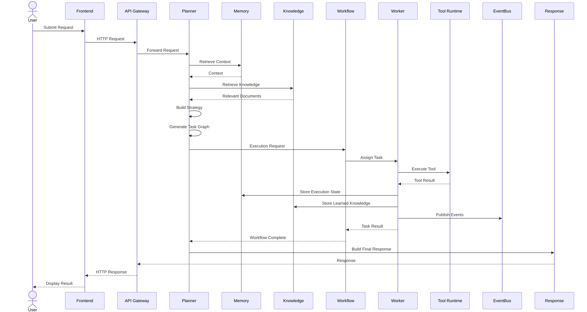

# Request Lifecycle

## Overview

Every interaction with the Synapse platform begins as a request. Regardless of whether the request originates from the Web Application, Mobile Application, CLI, or Public API, it follows a well-defined lifecycle before reaching completion.

The Request Lifecycle defines how a request is created, validated, planned, executed, monitored, completed, archived, and eventually removed from active execution.

Unlike the AI Execution Flow, which focuses on collaboration between services, this document focuses on the lifecycle of an individual request as it progresses through the platform.

Every request is treated as a first-class entity with its own identity, metadata, execution state, history, and audit trail.

---

# Architecture Diagram



---

# Objectives

The Request Lifecycle provides:

- Request tracking
- Execution visibility
- Failure recovery
- State management
- Progress monitoring
- Auditability
- Traceability
- Reproducibility

Every request can be inspected at any point during execution.

---

# Request Structure

Every request contains a standardized metadata object.

Example:

```json
{
  "request_id": "req_01HXYZ...",
  "workflow_id": "wf_01ABC...",
  "user_id": "user_123",
  "organization_id": "org_001",
  "priority": "HIGH",
  "status": "PENDING",
  "created_at": "...",
  "updated_at": "...",
  "trace_id": "...",
  "correlation_id": "...",
  "metadata": {}
}
```

Each identifier remains constant throughout execution.

---

# Request Lifecycle Overview

A request progresses through several well-defined stages.

```
Created

↓

Validated

↓

Planned

↓

Queued

↓

Executing

↓

Completed

↓

Archived
```

Requests may also enter exceptional states such as Failed, Cancelled, or Expired.

---

# Stage 1 — Request Creation

The lifecycle begins when a client submits a request.

Supported clients include:

- Web Application
- Mobile Application
- CLI
- Public API

The API Gateway creates a unique Request ID.

Example:

```
REQ-20260730-0001
```

Initial metadata is recorded.

---

# Stage 2 — Validation

The API Gateway validates the request before forwarding it.

Validation includes:

- Authentication
- Authorization
- Schema validation
- Rate limiting
- Input sanitization
- Request size limits

Invalid requests terminate immediately.

---

# Stage 3 — Registration

The request is registered within the platform.

Generated identifiers include:

- Request ID
- Workflow ID
- Trace ID
- Correlation ID

These identifiers enable distributed tracing.

---

# Stage 4 — Planning

The Planner Service analyzes the request.

Responsibilities include:

- Goal analysis
- Context retrieval
- Task decomposition
- Dependency analysis
- Capability mapping

The output is an execution plan.

The request status changes to:

```
PLANNED
```

---

# Stage 5 — Workflow Creation

The Workflow Service creates an executable workflow.

Operations include:

- Task registration
- Dependency graph creation
- Queue initialization
- State persistence

Status becomes:

```
QUEUED
```

---

# Stage 6 — Scheduling

The Scheduler determines when tasks may execute.

Scheduling considers:

- Dependencies
- Worker availability
- Priorities
- Organizational policies

Tasks enter the Ready Queue.

---

# Stage 7 — Execution

Workers begin processing tasks.

Status changes to:

```
RUNNING
```

Execution may include:

- AI reasoning
- Tool execution
- Data processing
- External API calls

Execution progress is continuously updated.

---

# Stage 8 — Monitoring

Throughout execution the platform records:

- Progress
- Worker assignments
- AI usage
- Tool usage
- Errors
- Retry attempts
- Execution duration

This information is persisted by the Memory Service.

---

# Stage 9 — Completion

After all tasks finish successfully:

The Workflow Service validates:

- Task completion
- Dependency satisfaction
- Output consistency

Status becomes:

```
COMPLETED
```

The response is returned to the client.

---

# Stage 10 — Archival

Completed requests remain available for:

- Analytics
- Auditing
- Historical lookup
- Organizational learning

Execution metadata is compressed and archived according to platform retention policies.

---

# Request States

A request may transition through multiple states.

```
CREATED

↓

VALIDATED

↓

PLANNED

↓

QUEUED

↓

RUNNING

↓

COMPLETED
```

Exceptional states include:

```
FAILED

CANCELLED

EXPIRED

RETRYING

PAUSED
```

State transitions are immutable and fully auditable.

---

# Request State Machine

```
CREATED
    │
VALIDATED
    │
PLANNED
    │
QUEUED
    │
RUNNING
   / \
  /   \
FAILED COMPLETED
  │
RETRYING
  │
RUNNING
```

Cancelled requests terminate immediately.

Expired requests are cleaned up automatically.

---

# Metadata Management

Every request accumulates metadata throughout execution.

Examples include:

Execution

- Start time
- End time
- Duration

AI

- Provider
- Model
- Token usage
- Cost

Workers

- Assigned worker
- Department
- Capabilities

Workflow

- Completed tasks
- Failed tasks
- Retry count

Observability

- Trace ID
- Correlation ID
- Logs
- Metrics

---

# Context Evolution

The request context evolves continuously.

```
User Input

↓

Planning Context

↓

Execution Context

↓

Runtime Context

↓

Final Context

↓

Archived Context
```

The Memory Service manages every context transition.

---

# Retry Lifecycle

Recoverable failures follow a retry lifecycle.

```
RUNNING

↓

FAILED

↓

WAITING

↓

RETRYING

↓

RUNNING
```

Retry policies include:

- Maximum retries
- Exponential backoff
- Timeout thresholds
- Error classification

---

# Cancellation Flow

Requests may be cancelled by:

- User
- Administrator
- Timeout
- Policy Engine

Cancellation triggers:

- Worker termination
- Queue cleanup
- Resource release
- Event publication

Final state:

```
CANCELLED
```

---

# Timeout Handling

Timeouts are managed by the Workflow Service.

Possible actions include:

- Retry
- Cancel task
- Escalate
- Notify administrator

Timeouts never leave orphaned workers.

---

# Event Lifecycle

Every significant lifecycle transition generates an event.

Example sequence:

```
RequestCreated

↓

RequestValidated

↓

WorkflowCreated

↓

ExecutionStarted

↓

TaskCompleted

↓

WorkflowCompleted

↓

RequestArchived
```

Events are published through the Event Bus.

---

# Observability

Every request is fully traceable.

Captured information includes:

- Trace ID
- Correlation ID
- Request latency
- Planning duration
- Execution duration
- AI latency
- Worker utilization

Logs, metrics, and traces share the same identifiers.

---

# Security

Request security includes:

- JWT authentication
- RBAC authorization
- Input validation
- Rate limiting
- Audit logging
- Data encryption

Every request is authenticated before execution begins.

---

# Scalability

Request management is designed for distributed execution.

```
Clients

↓

Load Balancer

↓

API Gateway

↓

Multiple Planner Instances

↓

Multiple Workflow Instances

↓

Worker Pools
```

Requests are processed independently and can execute concurrently across multiple nodes.

---

# Design Principles

The Request Lifecycle follows several core principles.

## Immutable Identity

Request identifiers never change.

---

## Observable Execution

Every transition is recorded.

---

## Event-Driven State Changes

State transitions generate events.

---

## Fault Tolerant

Failures are recoverable whenever possible.

---

## Stateless Services

Execution state is stored externally.

---

## Complete Audit Trail

Every request remains traceable from creation to archival.

---

# Related Documents

- 03 Planner Service
- 05 Memory Service
- 06 Workflow & Worker Runtime
- 07 AI Execution Flow
- 09 Event-Driven Architecture
- 10 Database & Storage Architecture
- 14 Observability Architecture

---

# Summary

The Request Lifecycle defines the complete journey of a request within the Synapse platform, from initial creation through validation, planning, execution, monitoring, completion, and archival. By treating every request as a first-class entity with immutable identifiers, explicit state transitions, and comprehensive observability, Synapse provides a reliable, auditable, and scalable execution model capable of supporting complex AI-driven workflows across distributed infrastructure.