# Event-Driven Architecture

## Overview

The Synapse platform is built around an event-driven architecture to enable scalable, loosely coupled, and highly resilient communication between distributed services. Rather than relying exclusively on synchronous API calls, services communicate by publishing and subscribing to events through a centralized Event Bus.

This architectural approach enables asynchronous execution, fault isolation, horizontal scalability, and real-time system observability. Every significant change in the platform—such as workflow creation, task completion, memory updates, or worker failures—is represented as an immutable event.

The Event Bus acts as the communication backbone of the platform, allowing services to collaborate without having direct knowledge of one another.

---

# Architecture Diagram



---

# Objectives

The Event-Driven Architecture provides:

- Loose coupling between services
- Asynchronous communication
- Reliable message delivery
- Fault isolation
- Horizontal scalability
- Event replay
- Workflow coordination
- Auditability
- Real-time monitoring

Every major service communicates through events whenever possible.

---

# Why Event-Driven?

Without an Event Bus:

```
Planner

↓

Workflow

↓

Worker

↓

Memory

↓

Knowledge
```

Each service becomes tightly coupled to the next.

With an Event Bus:

```
Planner

↓

Event Bus

↓

Workflow

↓

Event Bus

↓

Workers

↓

Event Bus

↓

Memory

Knowledge

Analytics
```

Services become independent producers and consumers of events.

---

# Core Components

## Event Bus

The Event Bus is the central messaging infrastructure of Synapse.

Responsibilities include:

- Event publishing
- Event routing
- Event persistence
- Delivery guarantees
- Retry management
- Dead letter handling
- Event ordering

Every event passes through the Event Bus.

---

## Event Publisher

Every service acts as an event publisher.

Examples:

Planner

Publishes:

- PlanCreated
- PlanningFailed

Workflow

Publishes:

- WorkflowStarted
- WorkflowCompleted

Worker Runtime

Publishes:

- TaskStarted
- TaskCompleted
- WorkerFailed

Memory Service

Publishes:

- MemoryUpdated

Knowledge Service

Publishes:

- DocumentIndexed

---

## Event Subscribers

Services subscribe only to events they require.

Example:

Workflow Service subscribes to:

- PlanCreated

Memory Service subscribes to:

- WorkflowCompleted
- WorkerCompleted

Analytics subscribes to:

- Every execution event

This minimizes service dependencies.

---

# Event Categories

The platform defines multiple event categories.

## Planning Events

Examples:

- PlanningStarted
- PlanningCompleted
- PlanningFailed

---

## Workflow Events

Examples:

- WorkflowCreated
- WorkflowStarted
- WorkflowCompleted
- WorkflowCancelled

---

## Task Events

Examples:

- TaskQueued
- TaskStarted
- TaskCompleted
- TaskFailed
- TaskRetried

---

## Worker Events

Examples:

- WorkerAssigned
- WorkerBusy
- WorkerIdle
- WorkerFailed

---

## Knowledge Events

Examples:

- DocumentUploaded
- DocumentIndexed
- RetrievalCompleted

---

## Memory Events

Examples:

- MemoryCreated
- MemoryUpdated
- ContextCompressed

---

## AI Events

Examples:

- AIRequestStarted
- AIResponseReceived
- ProviderSwitched

---

## Organization Events

Examples:

- DepartmentCreated
- WorkerPoolScaled
- CapabilityAdded

---

# Event Lifecycle

Every event follows a common lifecycle.

```
Created

↓

Validated

↓

Published

↓

Stored

↓

Delivered

↓

Processed

↓

Archived
```

Events remain immutable after publication.

---

# Event Structure

A standardized event format is used across the platform.

```json
{
  "event_id": "...",
  "event_type": "...",
  "timestamp": "...",
  "source": "...",
  "workflow_id": "...",
  "request_id": "...",
  "trace_id": "...",
  "payload": {}
}
```

This enables consistent processing and tracing.

---

# Event Topics

Events are organized into logical topics.

```
planning.*

workflow.*

task.*

worker.*

memory.*

knowledge.*

organization.*

analytics.*

notification.*
```

Services subscribe only to the topics they require.

---

# Communication Model

The platform supports two communication models.

## Synchronous

Used for:

- Authentication
- Immediate queries
- Health checks

Protocol:

- REST
- gRPC (future)

---

## Asynchronous

Used for:

- Workflow execution
- Notifications
- AI execution
- Background processing
- Analytics

Implemented through the Event Bus.

---

# Event Flow Example

A typical workflow execution generates the following events.

```
RequestCreated

↓

PlanningStarted

↓

PlanningCompleted

↓

WorkflowCreated

↓

TaskQueued

↓

WorkerAssigned

↓

TaskStarted

↓

AIRequestStarted

↓

AIResponseReceived

↓

TaskCompleted

↓

WorkflowCompleted

↓

MemoryUpdated

↓

NotificationSent
```

Each event may trigger multiple downstream actions.

---

# Delivery Guarantees

The Event Bus aims for **at-least-once delivery**.

This means:

- Events are not silently lost.
- Consumers must be idempotent.
- Duplicate events may occur.

Each event contains a unique Event ID to support deduplication.

---

# Dead Letter Queue

Events that cannot be processed after repeated retries are moved to a Dead Letter Queue (DLQ).

Examples include:

- Invalid payload
- Consumer failure
- Processing timeout

The DLQ enables manual inspection and replay.

---

# Event Replay

Stored events can be replayed to recover or rebuild system state.

Use cases include:

- Debugging
- Disaster recovery
- Analytics
- State reconstruction
- New service bootstrapping

Replay always preserves event ordering.

---

# Event Ordering

Within a single workflow, event order is preserved.

Example:

```
TaskStarted

↓

TaskCompleted

↓

WorkflowCompleted
```

Ordering across unrelated workflows is not guaranteed.

---

# Failure Handling

Possible failure scenarios include:

## Consumer Failure

Recovery:

Retry event delivery.

---

## Publisher Failure

Recovery:

Persist event before acknowledgement.

---

## Event Bus Failure

Recovery:

Failover to redundant broker.

---

## Duplicate Events

Recovery:

Consumers perform idempotent processing.

---

## Poison Message

Recovery:

Move event to the Dead Letter Queue.

---

# Observability

Every published event contains:

- Event ID
- Trace ID
- Correlation ID
- Timestamp
- Producer
- Consumer
- Processing duration

This enables end-to-end distributed tracing.

---

# Security

Event communication is protected using:

- Mutual TLS
- Authentication
- Authorization
- Event validation
- Encryption
- Audit logging

Only authorized services may publish or consume specific event types.

---

# Scalability

The Event Bus supports horizontal scaling.

```
Publishers

↓

Load Balanced Event Bus Cluster

↓

Consumers
```

Multiple consumers can process independent events concurrently.

---

# Design Principles

The Event-Driven Architecture follows several key principles.

## Loose Coupling

Services communicate through events rather than direct dependencies.

---

## Immutable Events

Published events are never modified.

---

## Eventual Consistency

Distributed services converge through asynchronous event processing.

---

## Idempotent Consumers

Consumers safely handle duplicate deliveries.

---

## Independent Scaling

Producers, brokers, and consumers scale independently.

---

# Future Enhancements

Potential improvements include:

- Event sourcing
- CQRS
- Saga orchestration
- Cross-region replication
- Multi-cluster event routing
- Event schema registry
- Stream processing
- Real-time analytics pipelines

---

# Related Documents

- 06 Workflow & Worker Runtime
- 07 AI Execution Flow
- 08 Request Lifecycle
- 10 Database & Storage Architecture
- 14 Observability Architecture
- 15 Organization Digital Twin

---

# Summary

The Event-Driven Architecture forms the communication backbone of the Synapse platform. By enabling asynchronous, loosely coupled interactions between services, it supports scalable workflow execution, reliable message delivery, fault isolation, and comprehensive observability. Immutable events, standardized schemas, and resilient delivery mechanisms ensure that the platform remains extensible, maintainable, and capable of orchestrating complex AI-driven workflows across distributed environments.