# Database & Storage Architecture

## Overview

The Database & Storage Architecture defines how the Synapse platform persists, retrieves, and manages data across its distributed services. Rather than relying on a single database technology, Synapse adopts a polyglot persistence strategy, selecting the most appropriate storage system for each type of data.

Each database has a clearly defined responsibility, ensuring optimal performance, scalability, maintainability, and operational simplicity. Application services never access storage systems outside of their ownership boundaries, preserving encapsulation and preventing tight coupling.

This architecture supports high-throughput AI workflows, long-running executions, semantic retrieval, and enterprise-scale data management while remaining cloud-native and horizontally scalable.

---

# Architecture Diagram



---

# Objectives

The storage architecture is designed to provide:

- Reliable persistence
- High availability
- Horizontal scalability
- Low-latency access
- Data consistency
- Efficient search
- Large file storage
- Separation of concerns
- Independent scaling

Each storage technology solves a specific problem rather than attempting to be a universal solution.

---

# Storage Overview

The Synapse platform uses five primary storage systems.

| Storage | Primary Purpose |
|----------|-----------------|
| PostgreSQL | Relational application data |
| Redis | Cache and transient execution state |
| ChromaDB | Vector embeddings |
| Elasticsearch | Full-text and keyword search |
| Object Storage | Files and binary objects |

Each service owns the data it writes.

---

# Polyglot Persistence

Synapse intentionally avoids storing all data in a single database.

Different workloads have different characteristics.

Examples include:

Relational Data

- Users
- Permissions
- Metadata

Vector Data

- Embeddings

Search Data

- Full-text indexes

Temporary Data

- Active workflow state

Large Files

- PDFs
- Images
- Videos

Using specialized storage improves performance and simplifies scaling.

---

# PostgreSQL

## Purpose

PostgreSQL is the primary transactional database.

It stores structured relational data requiring ACID guarantees.

---

## Responsibilities

Examples include:

- Users
- Organizations
- Roles
- Permissions
- Workflow metadata
- Execution metadata
- Memory metadata
- Knowledge metadata
- Configuration
- Audit references

---

## Characteristics

- ACID transactions
- Strong consistency
- Foreign key constraints
- Complex joins
- SQL querying

---

## Owned By

Examples:

- Identity Service
- Organization Service
- Planner Service
- Workflow Service
- Memory Service

---

# Redis

## Purpose

Redis provides ultra-low latency storage for temporary information.

It is never considered the source of truth.

---

## Responsibilities

Examples include:

- Session cache
- Working memory
- Active workflow state
- Distributed locks
- Rate limiting
- Queue metadata
- Context cache
- AI response cache

---

## Characteristics

- In-memory
- Extremely fast
- Ephemeral
- TTL support
- Pub/Sub support

---

## Typical Lifetime

Milliseconds to hours.

Never permanent storage.

---

# ChromaDB

## Purpose

Stores semantic vector embeddings.

---

## Responsibilities

Examples include:

- Document embeddings
- Knowledge embeddings
- Chunk embeddings
- Semantic indexes

---

## Used By

Knowledge Service.

No other service communicates directly with ChromaDB.

---

## Retrieval

Supports:

- Similarity search
- Nearest neighbor search
- Semantic retrieval

---

# Elasticsearch

## Purpose

Provides high-performance keyword search.

---

## Responsibilities

Examples include:

- BM25 search
- Metadata filtering
- Keyword indexing
- Log search (future)

---

## Characteristics

Optimized for:

- Text search
- Ranking
- Aggregations
- Filtering

---

# Object Storage

## Purpose

Stores binary objects.

Examples include:

- PDFs
- Images
- Videos
- Attachments
- Generated reports
- Presentations
- Exported artifacts

---

## Characteristics

- Durable
- Cheap
- Highly scalable

Metadata is stored separately in PostgreSQL.

---

# Storage Ownership

Every service owns its own data.

```
Identity Service

↓

PostgreSQL

----------------

Knowledge Service

↓

ChromaDB

↓

Elasticsearch

↓

Object Storage

----------------

Memory Service

↓

Redis

↓

PostgreSQL

----------------

Workflow Service

↓

PostgreSQL

↓

Redis
```

No service modifies another service's database directly.

Communication occurs through APIs.

---

# Data Classification

The platform classifies data into several categories.

## Transactional Data

Examples:

- Users
- Workflows
- Permissions

Storage:

PostgreSQL

---

## Cached Data

Examples:

- Session state
- AI cache
- Context cache

Storage:

Redis

---

## Semantic Data

Examples:

- Embeddings
- Vectors

Storage:

ChromaDB

---

## Search Data

Examples:

- Keywords
- Full-text indexes

Storage:

Elasticsearch

---

## Binary Data

Examples:

- Files
- Images
- Reports

Storage:

Object Storage

---

# Data Lifecycle

Every piece of data follows a lifecycle.

```
Created

↓

Validated

↓

Stored

↓

Read

↓

Updated

↓

Archived

↓

Deleted
```

Retention policies vary by data type.

---

# Data Flow

Example document ingestion.

```
PDF Upload

↓

Object Storage

↓

Preprocessing

↓

Chunking

↓

Embedding Generation

↓

ChromaDB

↓

Keyword Index

↓

Elasticsearch

↓

Metadata

↓

PostgreSQL
```

The document itself is stored only once.

---

# Backup Strategy

Persistent databases are backed up independently.

## PostgreSQL

- Daily full backups
- WAL archiving
- Point-in-time recovery

---

## Redis

Snapshotting and replication.

Cache data is rebuildable.

---

## ChromaDB

Periodic snapshot exports.

---

## Elasticsearch

Index snapshots.

---

## Object Storage

Cross-region replication.

Versioning enabled.

---

# Scalability

Each storage system scales independently.

```
Application Services

↓

Storage Layer

↓

PostgreSQL Cluster

Redis Cluster

ChromaDB Cluster

Elasticsearch Cluster

Object Storage
```

Scaling one database does not require scaling others.

---

# Security

Storage security includes:

- Encryption at rest
- TLS encryption
- RBAC
- Database authentication
- Secret management
- Audit logging
- Backup encryption

Sensitive information is never stored unencrypted.

---

# Performance Optimizations

Examples include:

- Database indexing
- Connection pooling
- Read replicas
- Query optimization
- Batch writes
- Redis caching
- Compression
- Partitioning

---

# Design Principles

## Polyglot Persistence

Use the best storage engine for each workload.

---

## Single Source of Truth

Every piece of data has one authoritative owner.

---

## Service Ownership

Only the owning service may modify its database.

---

## Independent Scaling

Storage systems scale independently.

---

## Storage Abstraction

Application logic never depends on storage implementation details.

---

# Future Enhancements

Potential improvements include:

- Multi-region replication
- Automatic tiered storage
- Cold archive storage
- Data lake integration
- Change Data Capture (CDC)
- Vector database sharding
- Cross-cluster search
- Automated retention policies

---

# Related Documents

- 04 Knowledge Service
- 05 Memory Service
- 06 Workflow & Worker Runtime
- 09 Event-Driven Architecture
- 11 Kubernetes Deployment
- 13 Security Architecture

---

# Summary

The Database & Storage Architecture defines how Synapse persists and manages information across specialized storage systems. By adopting a polyglot persistence strategy, assigning clear ownership to every dataset, and selecting storage technologies according to workload characteristics, the platform achieves high performance, scalability, fault tolerance, and maintainability while supporting enterprise-grade AI workflows.