# Kubernetes Deployment

## Overview

The Kubernetes Deployment Architecture defines how the Synapse platform is deployed, operated, and scaled in a cloud-native production environment. Each platform component is packaged as an independent container and deployed as a Kubernetes workload, allowing services to scale, recover, and evolve independently.

Rather than treating Kubernetes as an application framework, Synapse uses Kubernetes as its infrastructure orchestration layer. Responsibilities such as container scheduling, service discovery, rolling deployments, health monitoring, autoscaling, and self-healing are delegated to Kubernetes, allowing application services to focus solely on business logic.

This deployment model enables high availability, fault tolerance, operational consistency, and efficient resource utilization across the platform.

---

# Architecture Diagram



---

# Objectives

The deployment architecture provides:

- High availability
- Horizontal scalability
- Self-healing
- Rolling deployments
- Service discovery
- Secure networking
- Resource isolation
- Fault tolerance
- Operational simplicity

Every platform service is deployed independently.

---

# Deployment Overview

The Synapse platform consists of multiple independently deployable services.

```
Internet

↓

Ingress Controller

↓

API Gateway

↓

Platform Services

↓

AI Execution Layer

↓

Data Layer
```

Each service runs inside its own Kubernetes Deployment.

---

# Kubernetes Cluster Layout

The production environment consists of a Kubernetes cluster containing multiple node pools.

```
Kubernetes Cluster

├── Control Plane

└── Worker Nodes
      ├── Platform Services
      ├── Worker Runtime
      ├── AI Gateway
      ├── Supporting Services
      └── Monitoring Stack
```

Worker nodes execute application workloads, while the control plane manages cluster operations.

---

# Namespaces

Platform components are organized into dedicated namespaces.

| Namespace | Purpose |
|-----------|---------|
| synapse-system | Core platform services |
| synapse-workers | Worker Runtime |
| synapse-data | Stateful components |
| synapse-monitoring | Metrics and logging |
| synapse-ingress | Gateway and ingress |
| synapse-dev | Development deployments |

Namespaces provide logical isolation and simplified access control.

---

# Core Deployments

## API Gateway

Responsibilities:

- External entry point
- Authentication
- Rate limiting
- Request routing

Deployment:

```
Deployment

↓

ReplicaSet

↓

Pods
```

Multiple replicas ensure high availability.

---

## Planner Service

Deployment:

Independent Deployment

Replicas:

2–5

Autoscaling enabled.

---

## Workflow Service

Deployment:

Independent Deployment

Maintains orchestration while remaining stateless.

---

## Knowledge Service

Deployment:

Independent Deployment

Communicates with ChromaDB and Elasticsearch.

---

## Memory Service

Deployment:

Independent Deployment

Communicates with PostgreSQL and Redis.

---

## Organization Service

Deployment:

Independent Deployment

Provides worker capability management.

---

## AI Gateway

Deployment:

Independent Deployment

Routes requests to external AI providers.

---

## Worker Runtime

Workers are deployed separately from orchestration services.

```
Worker Deployment

↓

Worker Pods

↓

Task Queue
```

Worker replicas scale dynamically based on workload.

---

# Stateful Components

Stateful systems use StatefulSets instead of Deployments.

Examples include:

- PostgreSQL
- Redis
- ChromaDB
- Elasticsearch

Persistent Volumes are attached to each StatefulSet.

```
StatefulSet

↓

Persistent Volume Claim

↓

Persistent Volume
```

Application services remain stateless.

---

# Service Discovery

Every deployment is exposed through an internal Kubernetes Service.

Example:

```
Planner Service

↓

planner-service.default.svc.cluster.local
```

Services communicate using internal DNS rather than fixed IP addresses.

---

# Ingress

External traffic enters the cluster through an Ingress Controller.

Responsibilities include:

- HTTPS termination
- Load balancing
- Path routing
- TLS management

Flow:

```
Internet

↓

Load Balancer

↓

Ingress Controller

↓

API Gateway
```

No internal service is exposed directly to the internet.

---

# Networking

Communication follows a layered approach.

```
Client

↓

Ingress

↓

API Gateway

↓

Internal Services

↓

Databases
```

Network Policies restrict communication between namespaces and services.

Only authorized traffic is permitted.

---

# Autoscaling

Horizontal Pod Autoscaler (HPA) dynamically adjusts replicas.

Metrics include:

- CPU utilization
- Memory utilization
- Queue length
- Active workflows
- Worker utilization

Example:

```
Load ↑

↓

HPA

↓

2 Pods

↓

8 Pods
```

Scaling occurs automatically without downtime.

---

# Resource Management

Every deployment specifies resource requests and limits.

Example:

```yaml
resources:
  requests:
    cpu: "500m"
    memory: "512Mi"
  limits:
    cpu: "2"
    memory: "2Gi"
```

This prevents resource starvation and improves cluster stability.

---

# Health Checks

Every service exposes health endpoints.

## Liveness Probe

Determines whether a container should be restarted.

---

## Readiness Probe

Determines whether a pod can receive traffic.

---

## Startup Probe

Prevents premature restarts during initialization.

Example:

```
Pod

↓

Startup

↓

Ready

↓

Receives Traffic
```

---

# Rolling Deployments

Updates occur without downtime.

Deployment sequence:

```
Version 1

↓

Create New Pods

↓

Health Check

↓

Shift Traffic

↓

Remove Old Pods
```

If validation fails, Kubernetes automatically rolls back.

---

# Self-Healing

Kubernetes continuously monitors pod health.

If a pod crashes:

```
Pod Failure

↓

Restart

↓

New Pod Created

↓

Traffic Restored
```

Service availability is maintained automatically.

---

# Persistent Storage

Persistent workloads use Persistent Volume Claims (PVCs).

```
Application

↓

PVC

↓

Persistent Volume

↓

Storage Class
```

Storage survives pod restarts and rescheduling.

---

# Secrets Management

Sensitive information is never embedded inside container images.

Examples include:

- Database credentials
- JWT secrets
- API keys
- AI provider credentials

Secrets are injected using Kubernetes Secrets.

Configuration values are stored using ConfigMaps.

---

# Monitoring

Every deployment exports operational metrics.

Collected information includes:

- CPU
- Memory
- Network
- Request latency
- Error rate
- Queue depth
- Pod restarts

Metrics are consumed by the Monitoring stack.

---

# Logging

Application logs are written to stdout/stderr.

Logs are aggregated centrally.

Each log entry includes:

- Request ID
- Workflow ID
- Trace ID
- Service name
- Timestamp

Centralized logging enables end-to-end debugging.

---

# Security

Deployment security includes:

- RBAC
- Network Policies
- Pod Security Standards
- TLS encryption
- Image scanning
- Secret management
- Non-root containers
- Read-only root filesystem

Every workload follows the principle of least privilege.

---

# Disaster Recovery

Recovery strategies include:

## Pod Failure

Automatically restarted.

---

## Node Failure

Pods are rescheduled to healthy nodes.

---

## Availability Zone Failure

Workloads are redistributed across remaining zones.

---

## Cluster Recovery

Persistent volumes and backups restore application state.

---

# Scalability

Each deployment scales independently.

```
API Gateway

↓

Planner

↓

Workflow

↓

Workers

↓

AI Gateway
```

Scaling Worker Runtime does not require scaling the Planner or Workflow Service.

---

# Design Principles

## Stateless Application Services

Business services remain stateless.

Persistent state resides in dedicated storage systems.

---

## Independent Deployments

Every service is versioned and deployed independently.

---

## Infrastructure as Code

Cluster resources are defined declaratively using Kubernetes manifests or Helm charts.

---

## Cloud Native

Applications are designed for containerized execution.

---

## Self-Healing

Infrastructure automatically recovers from common failures.

---

# Future Enhancements

Potential improvements include:

- GitOps with Argo CD
- Service Mesh (Istio or Linkerd)
- Multi-region Kubernetes clusters
- Cluster Autoscaler
- KEDA for event-driven autoscaling
- Blue-Green deployments
- Canary releases
- GPU node pools for AI workloads
- Spot instance support for worker pools

---

# Related Documents

- 06 Workflow & Worker Runtime
- 09 Event-Driven Architecture
- 10 Database & Storage Architecture
- 12 CI/CD Pipeline
- 13 Security Architecture
- 14 Observability Architecture

---

# Summary

The Kubernetes Deployment Architecture defines how Synapse is deployed and operated in production using a cloud-native infrastructure. By deploying each service independently, leveraging Kubernetes for orchestration, and separating stateless application services from stateful storage components, the platform achieves high availability, automatic recovery, efficient resource utilization, and seamless horizontal scalability. This deployment model provides a resilient foundation capable of supporting enterprise-scale AI workloads while simplifying operational management.