# CI/CD Pipeline

## Overview

The Continuous Integration and Continuous Deployment (CI/CD) Pipeline defines how code changes progress from a developer's workstation to a production-ready deployment within the Synapse platform. The pipeline automates the processes of building, testing, validating, securing, packaging, and deploying software while ensuring that every release is reliable, reproducible, and auditable.

Synapse follows a GitOps-inspired workflow where every deployment originates from version-controlled infrastructure and application code. Each pipeline stage acts as a quality gate, preventing defective or insecure software from reaching production.

The CI/CD pipeline enables rapid development without sacrificing stability, security, or operational excellence.

---

# Architecture Diagram



---

# Objectives

The CI/CD Pipeline provides:

- Automated builds
- Continuous testing
- Security validation
- Artifact versioning
- Automated deployments
- Rollback support
- Infrastructure consistency
- Release traceability
- Operational reliability

Every code change follows the same standardized delivery process.

---

# Pipeline Overview

A typical deployment progresses through the following stages.

```
Developer

↓

Git Repository

↓

Continuous Integration

↓

Artifact Registry

↓

Continuous Deployment

↓

Kubernetes Cluster

↓

Production
```

Each stage validates the software before allowing it to progress.

---

# Pipeline Stages

## Stage 1 — Code Development

Developers implement new features, bug fixes, or architectural improvements.

Typical workflow:

```
Feature Branch

↓

Local Development

↓

Unit Testing

↓

Commit

↓

Push
```

Code should pass local validation before being committed.

---

## Stage 2 — Source Control

All application and infrastructure code is stored in Git repositories.

Repositories include:

- Platform Services
- Worker Runtime
- Infrastructure
- Kubernetes Manifests
- Helm Charts
- Documentation

Every change is associated with a commit history.

---

## Stage 3 — Pull Request Validation

Before merging into the main branch, every Pull Request undergoes automated validation.

Validation includes:

- Code formatting
- Static analysis
- Unit tests
- Dependency checks
- Secret scanning
- Security linting

Peer review is required before approval.

---

# Continuous Integration

Once a Pull Request is merged, the Continuous Integration pipeline begins.

Pipeline flow:

```
Checkout Code

↓

Install Dependencies

↓

Compile

↓

Run Tests

↓

Static Analysis

↓

Security Scanning

↓

Build Container

↓

Push Artifact
```

The pipeline terminates immediately if any stage fails.

---

# Build Stage

The build stage produces deployable artifacts.

Artifacts include:

- Docker Images
- Configuration Bundles
- Kubernetes Manifests
- Helm Charts

Every artifact is versioned.

---

# Testing Strategy

Multiple testing layers are executed.

## Unit Tests

Validate individual components.

---

## Integration Tests

Verify communication between services.

---

## API Tests

Validate public endpoints.

---

## Workflow Tests

Verify orchestration logic.

---

## End-to-End Tests

Validate complete execution scenarios.

---

## Performance Tests

Measure:

- Latency
- Throughput
- Resource utilization

Only successful builds continue.

---

# Static Analysis

Automated quality analysis includes:

- Code style
- Complexity analysis
- Dead code detection
- Dependency analysis
- Maintainability checks

These checks improve long-term code quality.

---

# Security Scanning

Every build undergoes automated security validation.

Examples include:

- Dependency vulnerability scanning
- Container image scanning
- Secret detection
- License compliance
- Infrastructure validation

Builds containing critical vulnerabilities are rejected.

---

# Artifact Registry

Successfully built artifacts are stored in a centralized registry.

Artifacts include:

- Docker Images
- Helm Charts
- Deployment Packages

Each artifact is immutable.

Example version:

```
synapse/planner:v1.4.2
```

Artifacts are never modified after publication.

---

# Continuous Deployment

Deployment begins after successful artifact publication.

Deployment flow:

```
Artifact Registry

↓

Deployment Validation

↓

Staging

↓

Smoke Tests

↓

Production
```

Each environment acts as a validation checkpoint.

---

# Deployment Environments

The platform supports multiple deployment environments.

| Environment | Purpose |
|-------------|---------|
| Development | Feature development |
| Testing | Automated validation |
| Staging | Pre-production verification |
| Production | Live platform |

Promotions occur sequentially.

---

# Deployment Strategy

Deployments follow a rolling update strategy.

```
Old Version

↓

Deploy New Pods

↓

Health Validation

↓

Traffic Shift

↓

Remove Old Pods
```

No downtime occurs during normal deployments.

---

# Rollback Strategy

If deployment validation fails:

```
Deployment Failure

↓

Rollback Triggered

↓

Previous Version Restored
```

Rollback uses previously validated container images.

---

# Infrastructure Deployment

Infrastructure changes are version controlled.

Examples include:

- Kubernetes manifests
- Helm charts
- ConfigMaps
- Secrets references
- Network Policies

Infrastructure follows the same review process as application code.

---

# Configuration Management

Application configuration is separated from application code.

Configuration includes:

- Environment variables
- Feature flags
- API endpoints
- Database connections

Sensitive values are stored in Kubernetes Secrets.

Non-sensitive configuration is managed through ConfigMaps.

---

# Versioning

Every release receives a unique version.

Example:

```
v2.3.1
```

Each deployment can be traced to:

- Git commit
- Build number
- Container image
- Deployment time
- Pipeline execution

This enables complete release traceability.

---

# Monitoring After Deployment

Deployments continue to be monitored after release.

Metrics include:

- Error rate
- Request latency
- CPU utilization
- Memory utilization
- Pod health
- Workflow success rate

Abnormal behavior can automatically trigger rollback.

---

# Failure Handling

Common failure scenarios include:

## Build Failure

Pipeline terminates immediately.

---

## Test Failure

Deployment is blocked.

---

## Security Failure

Build is rejected.

---

## Deployment Failure

Automatic rollback.

---

## Infrastructure Failure

Deployment pauses until the environment becomes healthy.

---

# Auditability

Every deployment records:

- Commit ID
- Author
- Reviewer
- Build number
- Deployment timestamp
- Target environment
- Artifact version

This creates a complete deployment history.

---

# Security

The pipeline follows secure software supply chain practices.

Measures include:

- Signed commits (optional)
- Least-privilege CI permissions
- Secret isolation
- Immutable artifacts
- Dependency verification
- Image vulnerability scanning
- Protected branches

Production deployments require authenticated automation.

---

# Scalability

The CI/CD platform supports:

- Parallel builds
- Parallel testing
- Incremental builds
- Multi-service deployments
- Independent service releases

Services are deployed independently without requiring full platform redeployment.

---

# Design Principles

## Automation First

Manual deployment steps are minimized.

---

## Immutable Artifacts

Artifacts are built once and promoted unchanged through environments.

---

## Shift Left Testing

Quality and security checks occur as early as possible.

---

## Deployment Safety

Every deployment must be reversible.

---

## Infrastructure as Code

Infrastructure definitions are version controlled alongside application code.

---

# Future Enhancements

Potential improvements include:

- GitOps with Argo CD
- Progressive delivery using Argo Rollouts
- Blue-Green deployments
- Canary deployments
- Automated performance regression testing
- Software Bill of Materials (SBOM)
- SLSA-compliant build pipeline
- Sigstore/Cosign image signing
- Policy-as-Code with Open Policy Agent (OPA)

---

# Related Documents

- 11 Kubernetes Deployment
- 13 Security Architecture
- 14 Observability Architecture
- 09 Event-Driven Architecture

---

# Summary

The CI/CD Pipeline provides a standardized, automated, and secure software delivery process for the Synapse platform. Through automated testing, security validation, artifact versioning, and controlled deployments, every release is validated before reaching production. By treating the delivery pipeline as a sequence of quality gates rather than a simple deployment mechanism, Synapse achieves reliable, traceable, and repeatable software releases while supporting rapid development and continuous improvement.