# Security Architecture

## Overview

The Security Architecture defines how the Synapse platform protects its users, services, data, infrastructure, and AI execution environment against unauthorized access, malicious activity, data leakage, and operational threats. Security is implemented as a defense-in-depth strategy, where multiple independent layers collaborate to reduce risk rather than relying on a single security mechanism.

Rather than existing as a dedicated service, security is embedded throughout every architectural layer of the platform—from request authentication and authorization to secure workload execution, encrypted storage, protected communication, and continuous security monitoring.

The objective is to ensure confidentiality, integrity, availability, and accountability across the entire platform while maintaining developer productivity and operational efficiency.

---

# Architecture Diagram



---

# Objectives

The Security Architecture provides:

- Authentication
- Authorization
- Secure communication
- Data protection
- Secret management
- Infrastructure security
- AI execution isolation
- Auditability
- Regulatory readiness

Security applies to every platform component rather than a single security service.

---

# Security Principles

The platform follows several fundamental security principles.

## Defense in Depth

Security controls exist at multiple layers.

Examples:

- API authentication
- RBAC
- TLS encryption
- Network policies
- Database encryption
- Kubernetes security
- Audit logging

Failure of one layer does not compromise the platform.

---

## Least Privilege

Every user, service, and worker receives only the permissions required to perform its responsibilities.

Examples:

- Workers receive task-specific permissions.
- Services access only their owned databases.
- AI providers never receive unnecessary data.

---

## Zero Trust

No component is trusted implicitly.

Every request must be:

- Authenticated
- Authorized
- Validated

Internal traffic is treated with the same security standards as external traffic.

---

## Secure by Default

The default platform configuration prioritizes security.

Examples:

- HTTPS enabled
- Authentication required
- Encryption enabled
- Logging enabled
- RBAC enforced

---

# Security Layers

Security is implemented across multiple architectural layers.

```
Users

↓

API Security

↓

Application Security

↓

Service Security

↓

Infrastructure Security

↓

Data Security

↓

Monitoring & Auditing
```

Each layer contributes independently to the overall security posture.

---

# Authentication

Every request entering the platform is authenticated.

Supported mechanisms include:

- JWT
- OAuth 2.0
- OpenID Connect (future)
- API Keys (service-to-service)

Responsibilities include:

- Identity verification
- Token validation
- Session management
- Token expiration

Unauthenticated requests are rejected immediately.

---

# Authorization

After authentication, authorization determines what the requester is allowed to do.

Authorization is implemented using Role-Based Access Control (RBAC).

Example roles:

- Administrator
- Developer
- User
- Viewer

Permissions include:

- Workflow execution
- Document access
- Organization management
- API usage
- Administrative operations

Authorization is enforced before business logic executes.

---

# API Security

The API Gateway serves as the primary security boundary.

Responsibilities include:

- JWT validation
- Rate limiting
- Request validation
- Input sanitization
- HTTPS enforcement
- API version validation
- Request logging

The API Gateway prevents unauthorized traffic from reaching internal services.

---

# Service-to-Service Security

Internal services communicate over authenticated and encrypted channels.

Security measures include:

- Mutual TLS (mTLS)
- Service identity
- Network policies
- Certificate validation

Services never communicate anonymously.

---

# AI Execution Security

Workers execute tasks inside isolated runtime environments.

Security controls include:

- Stateless execution
- Restricted permissions
- Tool access validation
- Execution time limits
- Resource quotas

Workers cannot access platform resources beyond their assigned task.

---

# Tool Security

Every tool invocation undergoes authorization before execution.

Validation includes:

- Tool permissions
- Input validation
- Output validation
- Timeout enforcement

Only approved tools may execute.

---

# AI Provider Security

Requests sent to external AI providers are protected.

Controls include:

- HTTPS encryption
- API key isolation
- Provider authentication
- Prompt sanitization
- Response validation

Sensitive internal secrets are never included in prompts.

---

# Data Security

Data protection applies to every storage system.

Examples include:

- Encryption at rest
- Encryption in transit
- Access control
- Backup encryption
- Secure deletion

Different storage technologies implement security appropriate to their responsibilities.

---

# Secret Management

Sensitive credentials are never stored in source code.

Examples include:

- Database passwords
- JWT signing keys
- AI provider credentials
- OAuth secrets
- Encryption keys

Secrets are managed using Kubernetes Secrets or an external secrets manager.

---

# Kubernetes Security

Deployment security includes:

- RBAC
- Network Policies
- Non-root containers
- Read-only root filesystem
- Pod Security Standards
- Image verification

Every workload follows the principle of least privilege.

---

# Network Security

Traffic is segmented across the platform.

```
Internet

↓

Ingress

↓

API Gateway

↓

Internal Services

↓

Databases
```

Only approved communication paths are permitted.

Internal traffic is protected using TLS.

---

# Database Security

Every database implements independent security controls.

Examples:

PostgreSQL

- Authentication
- TLS
- Role-based access

Redis

- Authentication
- Private networking

ChromaDB

- Restricted internal access

Elasticsearch

- Authentication
- TLS

Object Storage

- Signed URLs
- Bucket policies

Databases are never directly exposed to the internet.

---

# Encryption

Two forms of encryption are used.

## Encryption in Transit

All communication uses TLS.

Examples:

- Client → API Gateway
- Service → Service
- Service → Database
- Service → AI Provider

---

## Encryption at Rest

Stored data is encrypted.

Examples:

- Database volumes
- Object Storage
- Backups
- Persistent volumes

Encryption keys are managed separately.

---

# Input Validation

Every external input undergoes validation.

Validation includes:

- Schema validation
- Type checking
- Size limits
- File validation
- Sanitization

Invalid inputs are rejected before processing.

---

# Audit Logging

Security-relevant events are recorded.

Examples include:

- Login
- Logout
- Permission changes
- Workflow execution
- Administrative actions
- Failed authentication
- Secret access

Audit logs are immutable.

---

# Security Monitoring

Security monitoring continuously observes platform behavior.

Examples include:

- Authentication failures
- Rate-limit violations
- Suspicious API usage
- Privilege escalation attempts
- Unexpected network traffic
- Container restarts

Security events are forwarded to the observability stack.

---

# Incident Response

Potential incidents include:

- Credential compromise
- Unauthorized access
- Worker compromise
- Infrastructure breach
- Data leakage

Response actions include:

- Session revocation
- Key rotation
- Service isolation
- Traffic blocking
- Alert generation
- Forensic logging

---

# Compliance Considerations

The architecture supports common enterprise compliance requirements.

Examples include:

- Audit trails
- Encryption
- Access control
- Data retention
- Least privilege
- Secure backups

Compliance policies can evolve independently of application logic.

---

# Threat Mitigation

Common threats and mitigations include:

| Threat | Mitigation |
|---------|------------|
| Unauthorized access | Authentication + RBAC |
| Credential theft | Secret management + key rotation |
| Data interception | TLS encryption |
| SQL Injection | Parameterized queries |
| Prompt Injection | Input validation + prompt isolation |
| Denial of Service | Rate limiting + autoscaling |
| Container compromise | Non-root containers + runtime isolation |
| Data leakage | Least privilege + encryption |

---

# Security Across the Platform

Security responsibilities are distributed.

| Layer | Responsibilities |
|--------|------------------|
| API Gateway | Authentication, rate limiting, validation |
| Planner | Permission verification |
| Workflow | Execution authorization |
| Worker Runtime | Sandboxed execution |
| AI Gateway | Secure provider communication |
| Databases | Encryption and access control |
| Kubernetes | Isolation and workload security |
| CI/CD | Supply chain security |

---

# Scalability

Security mechanisms scale alongside the platform.

Examples include:

- Distributed authentication
- Stateless authorization
- Scalable RBAC
- Certificate rotation
- Secret synchronization

Security should never become a bottleneck.

---

# Design Principles

## Defense in Depth

Multiple independent security layers.

---

## Zero Trust

Every interaction is verified.

---

## Least Privilege

Minimum required permissions.

---

## Secure by Default

Safe configuration without manual intervention.

---

## Audit Everything

Every security-sensitive action is traceable.

---

# Future Enhancements

Potential improvements include:

- External Identity Provider integration
- Hardware Security Modules (HSM)
- SPIFFE/SPIRE workload identities
- Confidential Computing
- Web Application Firewall (WAF)
- Runtime threat detection
- OPA/Gatekeeper policy enforcement
- Secrets rotation automation
- AI-specific guardrails and policy engine
- Security Information and Event Management (SIEM)

---

# Related Documents

- 10 Database & Storage Architecture
- 11 Kubernetes Deployment
- 12 CI/CD Pipeline
- 14 Observability Architecture
- 15 Organization Digital Twin

---

# Summary

The Security Architecture establishes a comprehensive defense-in-depth strategy for the Synapse platform by embedding security into every architectural layer. Through authentication, authorization, encrypted communication, secure workload execution, data protection, infrastructure hardening, and continuous monitoring, the platform safeguards users, services, and information while supporting enterprise-scale AI workloads. By treating security as a platform-wide responsibility rather than an isolated component, Synapse achieves a resilient, scalable, and trustworthy foundation for AI-driven applications.