# Observability Architecture

## Overview

The Observability Architecture defines how the Synapse platform measures, monitors, traces, and analyzes its behavior in production. It provides comprehensive visibility into every layer of the platform—from user requests and AI execution to infrastructure resources and distributed workflows.

Observability enables engineers and operators to detect failures, diagnose performance bottlenecks, understand execution paths, measure system health, and continuously improve platform reliability.

Rather than treating observability as a monitoring tool, Synapse considers it a core platform capability embedded throughout every service.

Every request, workflow, task, and infrastructure component contributes telemetry that can be analyzed in real time.

---

# Architecture Diagram



---

# Objectives

The Observability Architecture provides:

- Real-time monitoring
- Distributed tracing
- Centralized logging
- Performance measurement
- Health monitoring
- Capacity planning
- Failure diagnosis
- Alerting
- Historical analysis

Every execution can be traced from request initiation to completion.

---

# Observability Pillars

The platform is built around three fundamental observability pillars.

## Metrics

Metrics answer:

> "What is happening?"

Examples:

- CPU usage
- Memory usage
- API latency
- Queue depth
- Active workflows
- AI token consumption
- Worker utilization

Metrics provide quantitative measurements over time.

---

## Logs

Logs answer:

> "What happened?"

Examples:

- Request received
- Worker assigned
- AI provider selected
- Workflow completed
- Retry initiated
- Authentication failed

Logs provide detailed execution records.

---

## Traces

Traces answer:

> "Why did it happen?"

Distributed traces connect every operation belonging to a single request.

Example:

```
User Request

↓

API Gateway

↓

Planner

↓

Workflow

↓

Worker

↓

AI Gateway

↓

Memory

↓

Response
```

Each service contributes one or more spans to the trace.

---

# Observability Architecture

```
Application Services

↓

Telemetry Collection

↓

Metrics

Logs

Traces

↓

Observability Platform

↓

Dashboards

Alerts

Analytics
```

All telemetry flows through a centralized collection pipeline.

---

# Metrics Collection

Every service exposes operational metrics.

Examples include:

API Gateway

- Request rate
- Error rate
- Latency

Planner

- Planning duration
- Plan complexity

Workflow

- Active workflows
- Queue length
- Scheduling latency

Worker Runtime

- Active workers
- Task duration
- Success rate

AI Gateway

- Token usage
- Provider latency
- Cost

Memory Service

- Cache hit ratio
- Context retrieval latency

Knowledge Service

- Search latency
- Retrieval accuracy

Infrastructure

- CPU
- Memory
- Disk
- Network

---

# Logging Architecture

All services generate structured logs.

Every log contains:

- Timestamp
- Log level
- Service name
- Request ID
- Workflow ID
- Trace ID
- Correlation ID
- Message

Example:

```json
{
  "timestamp": "...",
  "level": "INFO",
  "service": "workflow",
  "request_id": "...",
  "workflow_id": "...",
  "trace_id": "...",
  "message": "Task execution started."
}
```

Logs are immutable and centrally aggregated.

---

# Distributed Tracing

Every incoming request receives a Trace ID.

Example:

```
Trace ID

↓

API Gateway

↓

Planner

↓

Workflow

↓

Worker Runtime

↓

AI Gateway

↓

Knowledge

↓

Memory

↓

Response
```

Every service creates spans representing its work.

This enables complete end-to-end visibility.

---

# Correlation Identifiers

Each execution includes multiple identifiers.

| Identifier | Purpose |
|------------|---------|
| Request ID | User request |
| Workflow ID | Workflow execution |
| Task ID | Individual task |
| Trace ID | Distributed tracing |
| Span ID | Individual operation |
| Correlation ID | Cross-service linking |

These identifiers connect telemetry across the platform.

---

# Dashboards

Operational dashboards provide real-time platform visibility.

Examples include:

Platform Overview

- Requests per second
- Error rate
- Active workflows
- AI requests

Workflow Dashboard

- Running workflows
- Queue depth
- Retry count

Worker Dashboard

- Active workers
- Worker utilization
- Task duration

AI Dashboard

- Token usage
- Cost
- Provider latency
- Success rate

Infrastructure Dashboard

- CPU
- Memory
- Storage
- Network

---

# Health Monitoring

Every service exposes health endpoints.

Health checks include:

- Liveness
- Readiness
- Startup

Platform health is continuously monitored.

Examples:

- Database connectivity
- Redis availability
- AI provider availability
- Event Bus connectivity

---

# Alerting

Alerts are generated when platform behavior exceeds predefined thresholds.

Examples include:

Critical

- Service unavailable
- Database offline
- AI provider failure

Warning

- High latency
- Queue growth
- Elevated error rate

Informational

- Deployment completed
- Worker pool scaled

Alerts are routed to platform operators.

---

# AI Observability

AI execution introduces additional telemetry.

Examples include:

- Prompt latency
- Completion latency
- Model selection
- Provider selection
- Token usage
- Cost
- Retry count
- Fallback events

AI metrics help optimize both performance and operational cost.

---

# Workflow Observability

Workflow execution generates telemetry including:

- Workflow duration
- Task duration
- Parallelism
- Dependency waiting time
- Retry frequency
- Success rate

Each workflow can be analyzed independently.

---

# Infrastructure Monitoring

Infrastructure telemetry includes:

Compute

- CPU
- Memory

Networking

- Throughput
- Packet loss

Storage

- Disk utilization
- IOPS

Kubernetes

- Pod health
- Restart count
- Replica count

Infrastructure metrics help maintain cluster stability.

---

# Event Monitoring

The Event Bus exposes operational metrics.

Examples include:

- Published events
- Processed events
- Failed events
- Dead Letter Queue size
- Consumer lag
- Event latency

These metrics measure asynchronous communication health.

---

# Error Tracking

Errors are categorized.

Examples:

Application Errors

- Validation failure
- Business logic failure

Infrastructure Errors

- Database unavailable
- Network timeout

AI Errors

- Provider timeout
- Token limit exceeded

Worker Errors

- Execution failure
- Tool failure

Each error includes complete contextual information.

---

# Performance Analysis

Key performance indicators include:

- Request latency
- Workflow duration
- Planning latency
- AI response time
- Queue wait time
- Database latency
- Worker utilization

Historical trends support capacity planning and optimization.

---

# Capacity Planning

Observability data supports forecasting.

Examples:

- Worker pool growth
- Storage utilization
- Database scaling
- AI cost growth
- Network utilization

Trend analysis enables proactive infrastructure expansion.

---

# Auditability

Every execution generates an audit trail.

Recorded information includes:

- User
- Timestamp
- Workflow
- AI provider
- Tool usage
- Result status

Audit records support compliance and forensic analysis.

---

# Security Monitoring

Security telemetry includes:

- Failed authentication
- Permission violations
- Rate-limit violations
- Suspicious API activity
- Secret access
- Network anomalies

Security events integrate with the platform's alerting system.

---

# Data Retention

Telemetry is retained according to its type.

Examples:

Metrics

- High-resolution recent data
- Aggregated historical data

Logs

- Indexed
- Searchable
- Archived

Traces

- Sampled
- Retained based on policy

Retention policies balance operational insight with storage cost.

---

# Scalability

The observability platform scales independently.

```
Application Services

↓

Telemetry Pipeline

↓

Metrics Cluster

Logs Cluster

Trace Storage

↓

Dashboards
```

High telemetry volume does not impact application execution.

---

# Design Principles

## Observability by Default

Every service emits telemetry automatically.

---

## Structured Logging

Logs follow a standardized schema.

---

## End-to-End Tracing

Every request is fully traceable.

---

## Low Operational Overhead

Telemetry collection should have minimal performance impact.

---

## Actionable Alerts

Alerts should indicate conditions requiring investigation or action, avoiding unnecessary noise.

---

# Future Enhancements

Potential improvements include:

- OpenTelemetry Collector
- Distributed trace sampling
- AI anomaly detection
- Predictive alerting
- Service Level Objectives (SLOs)
- Error budgets
- Business metrics dashboards
- Real User Monitoring (RUM)
- Continuous profiling
- Automated root cause analysis

---

# Related Documents

- 06 Workflow & Worker Runtime
- 07 AI Execution Flow
- 08 Request Lifecycle
- 09 Event-Driven Architecture
- 11 Kubernetes Deployment
- 12 CI/CD Pipeline
- 13 Security Architecture

---

# Summary

The Observability Architecture provides comprehensive visibility into every aspect of the Synapse platform by collecting and correlating metrics, logs, and distributed traces across application services, infrastructure, AI execution, and workflows. Through centralized telemetry collection, real-time dashboards, intelligent alerting, and end-to-end tracing, the platform enables rapid fault detection, performance optimization, capacity planning, and operational excellence. By embedding observability into every architectural layer, Synapse ensures that complex distributed AI workflows remain transparent, measurable, and continuously improvable.