# Organization Digital Twin

## Overview

The Organization Digital Twin represents the organizational intelligence of the Synapse platform. Rather than treating AI workers as isolated agents, Synapse models them as members of a dynamic organization composed of departments, teams, capabilities, managers, and executive coordinators.

The Organization Digital Twin is responsible for understanding *who* can perform work, *how* work should be distributed, *which capabilities are available*, and *how organizational knowledge evolves over time*. It provides a digital representation of an adaptive enterprise capable of restructuring itself as workloads, capabilities, and priorities change.

Unlike the Workflow Service, which manages task execution, or the Planner, which determines what should be done, the Organization Digital Twin manages the organizational structure responsible for executing those plans.

It transforms a collection of independent workers into a coordinated AI enterprise.

---

# Architecture Diagram



---

# Objectives

The Organization Digital Twin provides:

- Organizational modeling
- Capability management
- Department management
- Dynamic team formation
- Worker allocation
- Organizational memory
- Resource optimization
- Workforce scaling
- Organizational learning

The Organization never executes business logic directly.

---

# Organizational Philosophy

The Synapse platform mirrors the structure of a real-world organization.

Instead of assigning work to anonymous workers, tasks are assigned to organizational capabilities.

Example:

```
Planner

↓

Research Capability

↓

Research Department

↓

Research Worker Pool

↓

Worker
```

This abstraction enables scalability without coupling workflows to individual workers.

---

# Organizational Hierarchy

The digital organization follows a hierarchical model.

```
Executive Coordinator

↓

Organization Engine

↓

Departments

↓

Managers

↓

Worker Pools

↓

Workers
```

Each layer has a clearly defined responsibility.

---

# Executive Coordinator

The Executive Coordinator represents the highest level of organizational coordination.

Responsibilities include:

- Organization-wide coordination
- Cross-department collaboration
- Strategic resource allocation
- Conflict resolution
- Organizational optimization

The Executive Coordinator does not execute workflows.

---

# Organization Engine

The Organization Engine manages the structure of the enterprise.

Responsibilities include:

- Create departments
- Merge departments
- Split departments
- Create teams
- Retire teams
- Scale worker pools
- Assign managers
- Update organizational topology

The Organization Engine continuously adapts the organization to changing workloads.

---

# Capability Registry

The Capability Registry maintains a structured inventory of organizational skills.

Examples include:

- Python
- Java
- SQL
- Research
- Planning
- Data Analysis
- Web Search
- Report Generation
- Docker
- Kubernetes
- Machine Learning

Capabilities describe *what* the organization can do rather than *who* performs the work.

---

# Departments

Departments group workers by functional specialization.

Examples include:

## Research Department

Responsibilities:

- Information gathering
- Competitive analysis
- Literature review

---

## Engineering Department

Responsibilities:

- Software development
- Code generation
- Testing
- Debugging

---

## Knowledge Department

Responsibilities:

- Document ingestion
- Knowledge management
- Semantic retrieval

---

## Operations Department

Responsibilities:

- Workflow monitoring
- Deployment
- Infrastructure automation

---

## Communication Department

Responsibilities:

- Report generation
- Documentation
- Email drafting
- Presentation creation

Departments remain organizational constructs rather than execution engines.

---

# Managers

Managers coordinate worker pools within a department.

Responsibilities include:

- Task distribution
- Worker selection
- Load balancing
- Progress monitoring
- Escalation handling

Managers never execute tasks directly.

---

# Worker Pools

Workers are grouped into capability-based pools.

Example:

```
Engineering Department

↓

Backend Pool

↓

Python Workers

↓

Worker #17
```

Worker pools enable efficient scheduling and horizontal scaling.

---

# Workers

Workers are stateless execution units.

Responsibilities include:

- AI reasoning
- Tool execution
- Data processing
- Result generation

Workers:

- Receive tasks
- Execute tasks
- Return results

Workers do not retain organizational knowledge.

---

# Dynamic Team Formation

The Organization Digital Twin can assemble temporary cross-functional teams.

Example:

```
New Product Launch

↓

Research

Engineering

Communication

↓

Temporary Team

↓

Workflow Execution
```

After completion, the temporary team is dissolved.

---

# Capability-Based Assignment

Tasks are assigned according to required capabilities.

Example:

```
Task

↓

Required Capabilities

↓

Capability Registry

↓

Matching Departments

↓

Worker Pool

↓

Worker
```

No workflow depends on a specific worker identity.

---

# Organizational Memory

The Organization Digital Twin maintains historical organizational knowledge.

Examples include:

- Previous projects
- Team performance
- Collaboration history
- Capability evolution
- Department metrics
- Resource utilization

This information supports future optimization.

---

# Organizational Learning

The organization continuously improves over time.

Learning signals include:

- Workflow success rate
- Worker utilization
- Department efficiency
- Collaboration effectiveness
- Capability demand
- Execution latency

These insights influence future organizational decisions.

---

# Resource Allocation

The Organization Engine optimizes resource usage.

Considerations include:

- Worker availability
- Department workload
- Capability demand
- Workflow priority
- Organizational policies

Resources are allocated dynamically rather than statically.

---

# Organizational Evolution

The organization evolves in response to workload changes.

Examples include:

```
Increased AI Demand

↓

Scale Worker Pool

↓

Assign Additional Managers

↓

Update Organization
```

Or:

```
Reduced Demand

↓

Merge Teams

↓

Reduce Worker Pools

↓

Optimize Resources
```

The organizational structure is continuously refined.

---

# Interactions with Other Services

## Planner Service

Queries:

- Capability Registry
- Organizational Memory

Receives:

- Capability mappings
- Organizational recommendations

---

## Workflow Service

Requests:

- Worker assignment
- Department selection

Receives:

- Execution-ready worker pools

---

## Memory Service

Stores:

- Organizational history
- Collaboration records
- Performance metrics

---

## Knowledge Service

Provides:

- Organizational documentation
- Capability descriptions
- Best practices

---

# Organizational Metrics

Examples include:

- Department utilization
- Worker utilization
- Capability coverage
- Team efficiency
- Collaboration frequency
- Average task duration
- Workflow completion rate

These metrics support organizational optimization.

---

# Security

Organizational security includes:

- Role-based administrative access
- Capability modification permissions
- Department management authorization
- Audit logging
- Organizational policy enforcement

Only authorized services may modify the organizational structure.

---

# Scalability

The organizational model scales horizontally.

```
Executive Coordinator

↓

Organization Engine

↓

Departments

↓

Managers

↓

Worker Pools

↓

Thousands of Workers
```

New departments and worker pools can be introduced without changing workflow logic.

---

# Design Principles

## Organization Before Execution

Organizational decisions precede task execution.

---

## Capability Over Identity

Tasks are assigned to capabilities rather than named workers.

---

## Stateless Workers

Workers remain disposable execution units.

---

## Dynamic Organizations

Departments and teams evolve according to demand.

---

## Organizational Learning

Historical execution data improves future organizational decisions.

---

## Separation of Coordination and Execution

Organization coordinates.

Workers execute.

---

# Future Enhancements

Potential improvements include:

- Automatic department creation
- Capability recommendation engine
- AI-based organizational optimization
- Workforce forecasting
- Skill gap analysis
- Organizational simulation
- Digital executive dashboards
- Cross-organization collaboration
- Multi-tenant organizations
- Self-organizing worker ecosystems

---

# Related Documents

- 03 Planner Service
- 05 Memory Service
- 06 Workflow & Worker Runtime
- 07 AI Execution Flow
- 09 Event-Driven Architecture
- 10 Database & Storage Architecture
- 14 Observability Architecture

---

# Summary

The Organization Digital Twin serves as the organizational intelligence layer of the Synapse platform, transforming independent AI workers into a coordinated, adaptive enterprise. By modeling departments, capabilities, managers, worker pools, and organizational memory, it determines how work should be distributed and how the organization should evolve over time. Through capability-based assignment, dynamic team formation, and continuous organizational learning, the Organization Digital Twin enables Synapse to operate not merely as a workflow engine, but as a self-organizing AI enterprise capable of adapting to changing workloads, optimizing resource utilization, and continuously improving its execution capabilities.